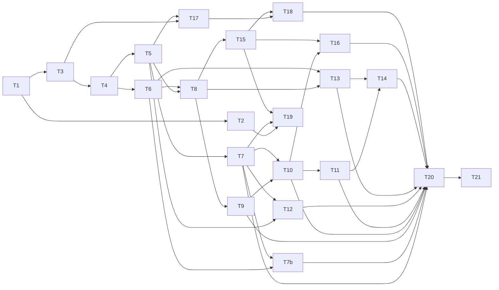

# Psicoman — Plano de Implementação (Tasks)
# Psicoman — Plano de Implementação (Tasks)

Plano de execução incremental. Cada task é demonstrável e testável, apoia-se nas anteriores e integra ao todo (sem código órfão). Refs apontam para [`requirements.md`](../../../docs/requirements.md) e [`architecture.md`](../../../docs/architecture.md).

Convenções:
- `[ ]` pendente · `[~]` em progresso · `[x]` concluído.
- Cada task só é considerada concluída com testes verdes e demo funcional.
- TDD onde fizer sentido; E2E obrigatório nos fluxos de negócio.

---

## Fase 0 — Fundação

- [x] **1. Fundação e esqueleto dos dois binários**
  - Estrutura de pastas (architecture §2), `cmd/admin` e `cmd/portal`, `go.mod`.
  - Config por arquivo (`internal/config`) + `config.example.yaml`.
  - Logger com níveis + rotação diária (`platform/logger`).
  - `Makefile` com `build` gerando os dois binários (saída = arquivo, não diretório).
  - **Aceite:** `make build` gera `psicoman-admin` e `psicoman-portal`; ambos sobem e respondem `/healthz`.
  - **Testes:** unit de config; smoke de boot.
  - **Refs:** requirements §1, §4.3 · architecture §2, §8.

- [x] **2. Persistência, migrations e ULID** (dep: 1)
  - SQLite WAL + `busy_timeout` (`repository/sqlite`).
  - Framework de migrations no boot (`internal/migration`, `migrations/`).
  - Gerador ULID compartilhado (`platform/ulid`).
  - **Aceite:** boot cria `.db` com schema versionado; ULID único e ordenável.
  - **Testes:** migrations em banco limpo; unicidade/ordenação ULID.
  - **Refs:** requirements §4.2 · architecture §3.

- [x] **3. Observabilidade e contrato de API** (dep: 1)
  - Middleware chain (`recover → request-id → timing → logging`).
  - Envelope de resposta padrão (message PT-BR + `elapsed_ms`).
  - `/healthz`, `/readyz`, `/livez`, `/metrics`; versionamento `/v1`; base Swagger.
  - **Aceite:** endpoints de saúde e envelope padrão respondendo.
  - **Testes:** E2E de saúde e do envelope.
  - **Refs:** requirements §4.3, §4.4 · architecture §5, §6.

## Fase 1 — Núcleo administrativo

- [x] **4. Autenticação admin (Pangolin)** (dep: 3)
  - Middleware valida header email + secret; audit log de acesso.
  - **Aceite:** `/v1/admin/me` retorna terapeuta autenticado; acesso negado tratado.
  - **Testes:** E2E permitido/negado.
  - **Refs:** requirements §2 · architecture §4.5.

- [x] **5. Cadastro de pacientes** (dep: 4)
  - CRUD paciente (nome/telefone/email obrigatórios, CPF opcional, origem, ULID).
  - Regra: bloqueio de recibo sem CPF (registrada p/ uso futuro).
  - **Aceite:** criar/listar/editar via API com validações.
  - **Testes:** E2E CRUD e validação.
  - **Refs:** requirements §3.1 · architecture §3.2.

- [x] **6. Locais de atendimento** (dep: 4)
  - CRUD local (endereço, modalidade, custo + periodicidade, disponibilidade).
  - **Aceite:** cadastrar locais presenciais e online.
  - **Testes:** E2E CRUD e validação de periodicidade.
  - **Refs:** requirements §3.2 · architecture §3.2.

- [x] **7. GED com hash e segregação por paciente** (dep: 5)
  - Repositório de arquivos em disco por paciente + metadados + SHA-256 + dedup.
  - **Aceite:** anexar arquivo a paciente e recuperá-lo íntegro.
  - **Testes:** E2E upload/download; verificação de hash e dedup.
  - **Refs:** requirements §3.6, §4.2 · architecture §4.2.

- [x] **7b. Perfil do terapeuta** (dep: 6, 7)
  - Entidade `therapist_profile` (um por instância): nome, CRP, email, contatos, bio; foto no GED; associação com locais (Task 6); links de plataformas (`therapist_platform_link`, opcionalmente ligados a uma origem).
  - **Aceite:** editar o perfil, associar locais, cadastrar links de plataforma e anexar foto; ler o perfil (dados públicos disponíveis para o portal).
  - **Testes:** E2E de edição do perfil, associação de locais e upload de foto.
  - **Refs:** requirements §3.9 · architecture §3.2, §5.1.

## Fase 2 — Sessões e financeiro

- [x] **8. Sessões e ciclo de vida** (dep: 5, 6)
  - Entidade sessão e transições (solicitada→agendada→realizada/cancelada/falta) com flags `bill` e `consider_cost`. Ainda sem Google — a checagem de conflito de agenda (freebusy) só é adicionada na Task 15, quando a integração existe; até lá, a transição para "agendada" não valida conflito.
  - **Aceite:** percorrer todos os estados via API.
  - **Testes:** E2E de transições e flags.
  - **Refs:** requirements §3.3 · architecture §4.1.

- [x] **9. Planos e geração de débito por tipo de plano** (dep: 8)
  - Planos por paciente. Gatilho de débito depende do tipo:
    - `pagamento_por_consulta`/`pagamento_por_mes`: ao finalizar sessão com `bill`, gera débito idempotente (`idempotency_key = session_id`).
    - `plano_fechado_mensal`/`plano_fechado_trimestral`: job de fechamento de ciclo (cron diário) gera débito no início do período (`idempotency_key = plan_id + billing_period`), independente de sessões.
    - `atendimento_social`: nunca gera débito (validado na camada de serviço).
  - **Aceite:** encerrar sessão de plano por consulta/mês gera exatamente um débito; plano fechado gera débito no fechamento do ciclo; social nunca gera débito; dupla execução não duplica em nenhum caso.
  - **Testes:** E2E de geração única por sessão; E2E do job de fechamento de ciclo; E2E de bloqueio para atendimento social.
  - **Refs:** requirements §3.4 · architecture §3.2, §4.1, §4.1.1.

- [x] **10. PDF de cobrança + GED** (dep: 9, 7)
  - Gerar PDF da cobrança e armazenar no GED.
  - **Aceite:** baixar PDF de cobrança de um débito.
  - **Testes:** E2E de geração e persistência.
  - **Refs:** requirements §3.4 · architecture §4.2.

- [x] **11. Quitação de débitos + comprovantes** (dep: 10)
  - Registrar pagamento quitando débito; anexar comprovantes ao GED.
  - **Aceite:** quitar débito com comprovante anexado.
  - **Testes:** E2E de quitação e anexo.
  - **Refs:** requirements §3.4 · architecture §3.2.

## Fase 3 — Prontuário, custos e relatórios

- [x] **12. Prontuário** (dep: 5, 7)
  - Anamnese; notas de sessão; notas livres (ordenadas por data); templates Markdown com envio formatado.
  - **Aceite:** registrar notas e gerar versão formatada de template.
  - **Testes:** E2E CRUD, ordenação, renderização Markdown.
  - **Refs:** requirements §3.6 · architecture §3.2.

- [x] **13. Custos, rateio proporcional e ROI por canal** (dep: 8, 6)
  - Custos (local, CRP, infra, plataformas); rateio proporcional por sessão; ROI por origem.
  - **Aceite:** relatório de custo por sessão/paciente e ROI do Doctoralia.
  - **Testes:** E2E de rateio e cruzamento receita×custo por origem.
  - **Refs:** requirements §3.5 · architecture §3.2, §4.1.

- [x] **14. Relatórios financeiros e de custos** (dep: 11, 13)
  - Débitos gerados/abertos/recebidos com atrasos; custos anual/mensal/paciente.
  - **Aceite:** relatórios financeiro e de custos via API.
  - **Testes:** E2E dos agregados.
  - **Refs:** requirements §3.4, §3.5 · architecture §5.1.

## Fase 4 — Integração Google

- [x] **15. OAuth + Calendar/Meet** (dep: 8)
  - OAuth 3-legged + refresh token cifrado; checagem de conflito (freebusy) antes de confirmar; confirmar sessão cria evento + Meet + convidado; reminders (1 dia + 30 min, configuráveis).
  - **Aceite:** confirmar sessão com conflito retorna 409; sem conflito, cria evento no Calendar (client mockado no E2E).
  - **Testes:** E2E com Google mockado (conflito e sucesso); unit de renovação de token.
  - **Refs:** requirements §3.3, §3.7 · architecture §4.1, §4.3.

- [x] **16. Envio de email (Gmail API)** (dep: 10, 15)
  - Enviar cobrança/templates por email via Gmail API.
  - **Aceite:** enviar cobrança por email ao paciente.
  - **Testes:** E2E com Gmail mockado.
  - **Refs:** requirements §3.4, §3.6, §3.7 · architecture §4.3.

## Fase 5 — Portal do paciente

- [x] **17. Auth social e cadastro** (dep: 3, 5)
  - OAuth Google no portal; sessão própria; cadastro básico; vínculo por email (upsert — não duplica paciente já cadastrado pelo admin); isolamento de dados; rate limiting por IP/email na rota pública de cadastro; TLS do portal (architecture §8).
  - **Aceite:** paciente loga e cria/vê seu perfil; não acessa dados de outros; cadastro com email já existente vincula ao registro do admin; excesso de requisições é limitado.
  - **Testes:** E2E de login, isolamento, vínculo por email e rate limit.
  - **Refs:** requirements §2, §3.1, §4.1 · architecture §4.5, §8.

- [x] **18. Agenda aberta, pedido e acompanhamento** (dep: 17, 15)
  - Ver lacunas; criar pedido (registro interno); ver agendamentos e débitos; tela de pendências no admin; confirmação cria evento (com checagem de conflito da Task 15); rate limiting na rota de pedido de agendamento.
  - **Aceite:** paciente solicita, terapeuta confirma, evento é criado; conflito de agenda bloqueia a confirmação.
  - **Testes:** E2E do fluxo pedido→confirmação→evento; E2E de conflito bloqueando confirmação.
  - **Refs:** requirements §3.3, §2, §4.1 · architecture §3.2, §4.1, §5.2.

## Fase 6 — Operação e fechamento

- [ ] **19. Backup/restore cifrado no Drive** (dep: 2, 7, 15)
  - Backup diário do SQLite (cifrado + compactado) no Drive; GED incremental por hash; restore.
  - **Aceite:** gerar backup e restaurar a base (round-trip).
  - **Testes:** E2E round-trip com Drive mockado.
  - **Refs:** requirements §3.8 · architecture §4.4.

- [ ] **20. Interface web (admin e portal) responsiva** (dep: 5–18)
  - Front embutido (`embed.FS`); admin com navegação lateral/dashboards; portal minimalista mobile-first; Pico/Tailwind + htmx/Alpine; WCAG AA.
  - **Aceite:** usar o sistema ponta a ponta pela UI no desktop e no celular.
  - **Testes:** E2E de fluxos-chave pela UI; verificação de contraste/foco.
  - **Refs:** requirements §4.5 · architecture §2, §5.

- [ ] **21. Audit log, Swagger final e hardening E2E** (dep: todas)
  - Consolidar audit log de operações sensíveis; finalizar Swagger; suíte E2E completa.
  - **Aceite:** Swagger navegável; suíte E2E completa verde.
  - **Testes:** suíte E2E cobrindo todos os fluxos.
  - **Refs:** requirements §4.1, §4.4 · architecture §6, §7.

---

## Grafo de dependências (resumo)

## Rastreabilidade requisito → task

| Requisito (requirements) | Tasks |
|-------------------|-------|
| Agenda / Google / conflito / notificações (§3.3) | 8, 15, 18 |
| Cadastro de pacientes / unicidade (§3.1) | 5, 17 |
| Locais (§3.2) | 6, 13 |
| Perfil do terapeuta (§3.9) | 7b |
| Pagamentos / débitos por tipo de plano / recibos (§3.4) | 9, 10, 11, 14, 16 |
| Custos / ROI (§3.5) | 13, 14 |
| Prontuário / templates (§3.6) | 12 |
| Integração Google (§3.7) | 15, 16 |
| Backup/restore (§3.8) | 19 |
| Portal do paciente / vínculo por email (§2, §3.1) | 17, 18 |
| Segurança / auth / TLS / rate limiting (§2, §4.1) | 4, 17, 18, 21 |
| Observabilidade / API / Swagger (§4.3, §4.4) | 3, 21 |
| UI/UX (§4.5) | 20 |
