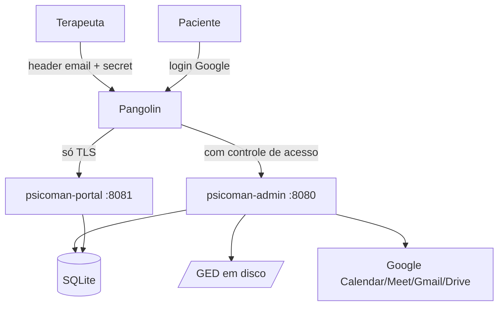

# Psicoman — Guia de Instalação e Deploy

Guia passo a passo para colocar uma instância do Psicoman no ar. Cada terapeuta
roda **uma instância isolada** (uma VM por terapeuta), com dois binários
(`psicoman-admin` e `psicoman-portal`) atrás do gateway **Pangolin**.

> Este guia cobre: pré-requisitos, provisão da VM, criação das credenciais
> Google (Calendar/Meet, Gmail, Drive), configuração do Pangolin, execução do
> instalador (`deploy.sh`) e atualização segura (`update-server.sh`).
>
> Referências de arquitetura: [`docs/architecture.md`](./docs/architecture.md) ·
> requisitos: [`docs/requirements.md`](./docs/requirements.md).

---

## Visão geral do que você vai montar



- Os binários escutam **apenas em `127.0.0.1`** (loopback). Quem expõe para a
  internet, com TLS, é o Pangolin.
- O **admin** fica atrás do Pangolin **com controle de acesso**; o **portal**
  fica atrás do Pangolin **só com TLS** (a autenticação do paciente é feita pela
  própria aplicação, via login Google).

---

## 1. Pré-requisitos

Na sua máquina de trabalho e/ou na VM:

| Ferramenta | Uso | Como checar |
|-----------|-----|-------------|
| Go 1.24+  | compilar os binários | `go version` |
| git       | clonar/atualizar o código | `git --version` |
| openssl   | gerar chaves e secrets | `openssl version` |
| curl      | validação de saúde | `curl --version` |
| systemd   | rodar como serviço (recomendado) | `systemctl --version` |
| sqlite3   | (opcional) backup a quente no update | `sqlite3 --version` |

Uma conta **Google pessoal** (Google One serve) do terapeuta — sem necessidade
de Google Workspace.

---

## 2. Provisão da VM

O Psicoman foi pensado para uma VM privada (ex.: Proxmox). Qualquer Linux
recente com systemd serve.

1. Crie a VM (2 vCPU / 2 GB RAM / 20 GB disco já é confortável para um consultório).
2. Atualize o sistema e instale as dependências:

   ```bash
   sudo apt update && sudo apt -y upgrade
   sudo apt -y install git curl openssl sqlite3
   # Go (se não vier no repositório na versão desejada):
   #   baixe de https://go.dev/dl/ e ajuste o PATH.
   ```

3. Clone o repositório:

   ```bash
   git clone https://github.com/rafaelfino/psicoman.git
   cd psicoman
   ```

Guarde o **fuso** do servidor. O sistema opera em `America/Sao_Paulo`
internamente; ainda assim, mantenha o relógio da VM sincronizado (NTP).

---

## 3. Criar as credenciais do Google

O Psicoman usa **OAuth 3-legged** com refresh token (conta pessoal, sem
domain-wide delegation). Você vai criar um projeto no Google Cloud, configurar a
tela de consentimento, habilitar as APIs e gerar um **Client ID + Client Secret**.

> A navegação do Google Cloud muda de tempos em tempos; os nomes abaixo refletem
> a interface atual ("Google Auth platform" / "APIs e Serviços"). Se algum rótulo
> divergir, procure pelo termo equivalente.
> Referência oficial: [Configurar a tela de consentimento OAuth](https://developers.google.com/workspace/guides/configure-oauth-consent).
> _Conteúdo adaptado das docs do Google para fins deste guia._

### 3.1 Criar o projeto e habilitar as APIs

1. Acesse <https://console.cloud.google.com/> e crie um **novo projeto**
   (ex.: `psicoman-<seu-nome>`).
2. Em **APIs e Serviços → Biblioteca**, habilite:
   - **Google Calendar API**
   - **Gmail API**
   - **Google Drive API**

### 3.2 Configurar a tela de consentimento

1. Vá em **APIs e Serviços → Tela de permissão OAuth** (ou **Google Auth
   platform → Branding**).
2. Tipo de usuário: **Externo** (conta pessoal).
3. Preencha nome do app, e-mail de suporte e e-mail do desenvolvedor.
4. Em **Escopos**, adicione exatamente (escopos mínimos):
   - `https://www.googleapis.com/auth/calendar`
   - `https://www.googleapis.com/auth/gmail.send`
   - `https://www.googleapis.com/auth/drive.file`
   - (para o login do portal) `openid`, `email`, `profile`
5. Em **Usuários de teste**, adicione o e-mail do terapeuta (e, se for testar o
   portal, o e-mail de um paciente de teste). Enquanto o app estiver em modo de
   teste, só esses e-mails conseguem autorizar — o que é suficiente para uma
   instância pessoal.

### 3.3 Criar as credenciais OAuth

1. Em **APIs e Serviços → Credenciais → Criar credenciais → ID do cliente OAuth**.
2. Tipo de aplicativo: **Aplicativo da Web**.
3. Em **URIs de redirecionamento autorizados**, adicione a URL de callback do
   admin (a mesma que você vai informar ao `deploy.sh`), por exemplo:

   ```
   https://admin.seudominio.com.br/v1/admin/google/callback
   ```

   Se o portal também usar login Google com redirect próprio, adicione a URL
   equivalente do portal.
4. Salve. Copie o **Client ID** e o **Client Secret** — você vai colá-los no
   instalador. **Nunca** versione esses valores.

### 3.4 Autorizar (depois do deploy)

Após subir a aplicação (passo 6), conclua a autorização uma única vez:

```bash
# Obtenha a URL de consentimento (autenticado como admin, via Pangolin):
curl -X POST https://admin.seudominio.com.br/v1/admin/google/authorize \
  -H "X-Pangolin-Email: terapeuta@example.com" \
  -H "X-Pangolin-Secret: SEU_SECRET"
# Abra a authorize_url no navegador, conceda o acesso e copie o `code` do retorno.
# Finalize a troca:
curl -X POST https://admin.seudominio.com.br/v1/admin/google/callback \
  -H "X-Pangolin-Email: terapeuta@example.com" \
  -H "X-Pangolin-Secret: SEU_SECRET" \
  -H "Content-Type: application/json" \
  -d '{"code":"CODIGO_DEVOLVIDO_PELO_GOOGLE"}'
```

A partir daí o refresh token fica **cifrado** no banco e o access token é
renovado automaticamente. Se a renovação falhar no futuro, o `/readyz` do admin
passa a reportar `degraded` (reautorização pendente) — basta repetir este passo.

---

## 4. Configurar o Pangolin

O Pangolin (OCI) fica na frente e termina o TLS/HTTPS para as duas aplicações.
A diferença crucial:

- **admin** → Pangolin **com controle de acesso**. O gateway injeta o header de
  e-mail do terapeuta e você configura o secret compartilhado. A aplicação
  **revalida** o e-mail e o secret por conta própria (defense in depth).
- **portal** → Pangolin **só termina TLS**, sem controle de acesso. A
  autenticação é da aplicação (login Google) e há rate limiting nas rotas
  públicas.

Configuração recomendada (nomes exatos variam conforme a versão do Pangolin):

1. **Recurso/serviço admin**
   - Destino (upstream): `http://127.0.0.1:8080` (ou a porta escolhida no deploy).
   - Domínio público: `admin.seudominio.com.br` (TLS gerenciado pelo Pangolin).
   - Controle de acesso: **ativado**. Configure o provedor de identidade do
     Pangolin de forma que ele **injete o header com o e-mail do terapeuta**
     (o mesmo `email_header` do config, por padrão `X-Pangolin-Email`).
   - Header de secret: faça o Pangolin (ou um header estático no recurso) enviar
     `X-Pangolin-Secret: <secret gerado no deploy>`. Esse é o segundo fator que a
     aplicação valida.

2. **Recurso/serviço portal**
   - Destino: `http://127.0.0.1:8081`.
   - Domínio público: `portal.seudominio.com.br`.
   - Controle de acesso: **desativado** (só TLS). O portal cuida da própria auth.

3. **DNS**: aponte `admin.seudominio.com.br` e `portal.seudominio.com.br` para o
   Pangolin, conforme a documentação do seu gateway.

> Importante: como os binários escutam só em `127.0.0.1`, eles **não** ficam
> acessíveis diretamente da internet. Todo o tráfego externo passa
> obrigatoriamente pelo Pangolin.

---

## 5. Instalar com `deploy.sh`

Na VM, dentro do repositório, rode o instalador interativo:

```bash
sudo ./scripts/deploy.sh
```

Ele vai:

1. Verificar os pré-requisitos.
2. Perguntar tudo o que a aplicação precisa (com valores padrão sensatos):
   - usuário de serviço, diretórios de instalação e de dados;
   - hosts/portas do admin e do portal (mantenha em `127.0.0.1`);
   - e-mail do terapeuta e **secret** do admin (pode gerar automaticamente);
   - nomes dos headers do Pangolin;
   - Client ID / Secret do Google, redirect URL, Calendar ID, pasta de backup;
   - intervalos de lembrete e limites de rate limiting;
   - nível de log.
3. Gerar a **chave de cifragem AES-256** automaticamente.
4. Compilar os dois binários (`make build`).
5. Gerar o `config.yaml` (permissão `600`) em `/opt/psicoman` (padrão).
6. Criar o usuário de serviço, os diretórios de dados e as **units systemd**
   (`psicoman-admin`, `psicoman-portal`), habilitando e iniciando os serviços.
7. Validar o `/readyz` de cada serviço.

Ao final, o script imprime o **secret admin** (se gerado) — configure-o no
Pangolin. Anote-o com cuidado; ele não é exibido de novo.

### Verificação rápida

```bash
# Localmente na VM:
curl -s http://127.0.0.1:8080/healthz   # {"status":"ok"}
curl -s http://127.0.0.1:8080/readyz    # {"status":"ready"} (ou degraded se Google pendente)
curl -s http://127.0.0.1:8081/healthz

# Pelo domínio (após configurar o Pangolin):
curl -s https://admin.seudominio.com.br/healthz
```

Documentação da API (Swagger): `https://admin.seudominio.com.br/v1/swagger`.

### Primeiro uso

1. Autorize o Google (passo 3.4).
2. Configure seu perfil:

   ```bash
   curl -X PUT https://admin.seudominio.com.br/v1/admin/profile \
     -H "X-Pangolin-Email: terapeuta@example.com" \
     -H "X-Pangolin-Secret: SEU_SECRET" \
     -H "Content-Type: application/json" \
     -d '{"name":"Dra. Fulana","crp":"06/12345","email":"terapeuta@example.com"}'
   ```

3. Cadastre locais, pacientes e comece a operar (ou use a UI em `/app/`).

---

### Sobre colocar um nginx na frente do portal

**Não é necessário no deploy padrão.** O Pangolin já é a borda: termina o TLS e é
o lugar certo para as proteções de rede (limite de conexões, `limit_req`,
tamanho máximo de body, timeouts contra conexões lentas). O Psicoman ainda tem
**rate limiting por IP e por e-mail na própria aplicação** como defesa em
profundidade nas rotas públicas do portal.

Adicionar um nginx **entre o Pangolin e o portal** seria uma terceira camada com
pouco ganho — configure essas proteções no próprio Pangolin. Um proxy dedicado
(nginx/Caddy) só passa a valer se, em algum cenário, o portal for exposto
**fora** do Pangolin; aí ele assumiria a terminação de TLS e o rate limit de
borda. Enquanto o portal estiver atrás do Pangolin, não coloque nginx.

Recomendações de borda no Pangolin para o portal:
- limitar requisições por IP nas rotas `/v1/portal/register` e
  `/v1/portal/appointment-requests`;
- limitar o tamanho do corpo das requisições (o app já limita, mas cortar na
  borda evita processamento desnecessário);
- timeouts curtos para mitigar conexões lentas.

---

## 6. Execução local (desenvolvimento) — auth desligada

Para validar a aplicação na sua máquina, sem Pangolin e sem autenticação, use o
**modo dev**. Ele desliga a autenticação do admin e aceita o login do portal com
qualquer e-mail (sem chamar o Google). **Nunca** ligue isso em produção.

```bash
# Sobe admin (:8080) e portal (:8081) em modo dev, gerando um config.dev.yaml:
make run-local
```

O `make run-local` cria um `config.dev.yaml` (com `dev_mode: true`, dados em
`./data-dev`, chave de cifragem gerada na hora) e sobe os dois binários. Depois:

```bash
# Admin sem headers de autenticação (dev):
curl -s http://localhost:8080/v1/admin/me
curl -s http://localhost:8080/v1/admin/patients

# UI:
#   http://localhost:8080/        (admin)
#   http://localhost:8081/        (portal)

# Portal (login aceita a credencial como e-mail em dev):
curl -s -c cookies.txt -X POST http://localhost:8081/v1/portal/login \
  -H 'Content-Type: application/json' -d '{"credential":"paciente@example.com"}'
curl -s -b cookies.txt http://localhost:8081/v1/portal/me
```

Para gerar um `config.dev.yaml` manualmente, copie o `config.example.yaml` e
ajuste `dev_mode: true`. Em modo dev as credenciais do admin não são
obrigatórias.

### Qualidade do código

```bash
make fmt         # formata (gofmt -w)
make fmt-check   # falha se algo não estiver formatado
make vet         # go vet
make lint        # golangci-lint se instalado (advisory) + fmt-check + vet
make test        # unitários + E2E
make check       # gate completo: fmt-check + vet + build + testes + e2e (+ lint advisory)
```

O gate obrigatório é **gofmt + go vet + build + testes**. O `golangci-lint`, se
instalado, roda como camada extra (advisory).

---

## 7. Atualizar com `update-server.sh`

Para atualizar a instância com uma nova versão do repositório oficial, com
segurança (backup antes, validação depois, rollback se falhar):

```bash
# Última tag publicada:
sudo ./scripts/update-server.sh

# Ou uma versão específica:
sudo ./scripts/update-server.sh --ref v1.2.0
```

O que o script faz, em ordem:

1. **Backup completo** em `<data-dir>/updates/<timestamp>/`: base SQLite
   (a quente via `sqlite3 .backup` quando disponível), GED (`.tar.gz`), o
   `config.yaml` e os binários atuais.
2. `git fetch` + checkout da versão alvo (última tag por padrão).
3. **Recompila**. Se a compilação falhar, **aborta sem tocar em produção**.
   Roda também os testes unitários e pede confirmação se algum falhar.
4. Substitui os binários (os anteriores ficam no backup) e reinicia os serviços.
   As **migrations são aplicadas automaticamente no boot** dos binários.
5. Valida o `/readyz` dos dois serviços. Se **qualquer um** falhar, executa
   **rollback**: restaura os binários anteriores e a base do backup, reinicia e
   revalida.

Parâmetros úteis:

```
--ref <tag|branch|commit>   Versão alvo (default: última tag).
--install-dir DIR           Onde estão os binários (default: /opt/psicoman).
--data-dir DIR              Diretório de dados (default: /var/lib/psicoman).
--repo URL                  Repositório (default: github.com/rafaelfino/psicoman).
```

> O script detecta as portas do admin/portal lendo o `config.yaml`, então a
> validação de `/readyz` funciona sem configuração extra.

---

## 8. Backup e restauração (operação contínua)

Além do backup automático do `update-server.sh`, a aplicação faz **backup diário
cifrado no Google Drive** (SQLite compactado + cifrado; GED incremental por
hash). Você também pode disparar manualmente:

```bash
# Backup imediato:
curl -X POST https://admin.seudominio.com.br/v1/admin/backup \
  -H "X-Pangolin-Email: terapeuta@example.com" -H "X-Pangolin-Secret: SEU_SECRET"

# Restaurar do último snapshot (reinicie os serviços em seguida):
curl -X POST https://admin.seudominio.com.br/v1/admin/restore \
  -H "X-Pangolin-Email: terapeuta@example.com" -H "X-Pangolin-Secret: SEU_SECRET"
sudo systemctl restart psicoman-admin psicoman-portal
```

A chave de cifragem vive **apenas** no `config.yaml`. Guarde uma cópia segura
dela fora da VM — sem a chave, os backups no Drive não podem ser restaurados.

---

## 9. Operação do dia a dia

```bash
# Status e logs:
sudo systemctl status psicoman-admin psicoman-portal
sudo journalctl -u psicoman-admin -f
sudo journalctl -u psicoman-portal -f

# Reiniciar:
sudo systemctl restart psicoman-admin psicoman-portal

# Logs em arquivo (rotação diária):
ls /var/lib/psicoman/logs/
```

Saúde e métricas:

- `/healthz` — o processo está vivo.
- `/readyz` — dependências OK (SQLite, autorização Google).
- `/livez` — liveness.
- `/metrics` — métricas em formato texto (latência por rota, contagens).

---

## 10. Solução de problemas

| Sintoma | Provável causa | O que fazer |
|--------|----------------|-------------|
| `/readyz` = `degraded` (google) | refresh token do Google expirou/revogado | Refaça a autorização (passo 3.4) |
| Admin retorna `401` sempre | header/secret do Pangolin não batem com o config | Confira `email`, `secret` e os nomes dos headers |
| Portal retorna `401` nas rotas `/me` | sessão ausente/expirada | Faça login novamente pelo portal |
| Sessão não vira evento no Calendar | Google não autorizado | Autorize o Google (passo 3.4) |
| `deploy.sh` não cria serviços | rodou sem `sudo` ou sem systemd | Rode com `sudo`; ou suba os binários manualmente |
| Admin aceita tudo sem auth | `dev_mode: true` ligado | Só use dev localmente; em produção mantenha `dev_mode: false` |
| Update falhou e reverteu | nova versão não passou no `/readyz` | Veja o backup em `updates/<ts>/` e os logs; reporte o problema |

---

## 11. Checklist final

- [ ] VM provisionada, dependências instaladas, relógio sincronizado.
- [ ] Projeto Google criado, APIs habilitadas, consentimento configurado.
- [ ] Client ID + Secret gerados; redirect URL cadastrada.
- [ ] Pangolin: admin com controle de acesso; portal só TLS; DNS apontado.
- [ ] `deploy.sh` executado; `/readyz` OK nos dois serviços.
- [ ] Google autorizado; perfil do terapeuta configurado.
- [ ] Chave de cifragem copiada para um cofre seguro fora da VM.
- [ ] Teste de ponta a ponta: cadastrar paciente → agendar → finalizar → cobrar.
