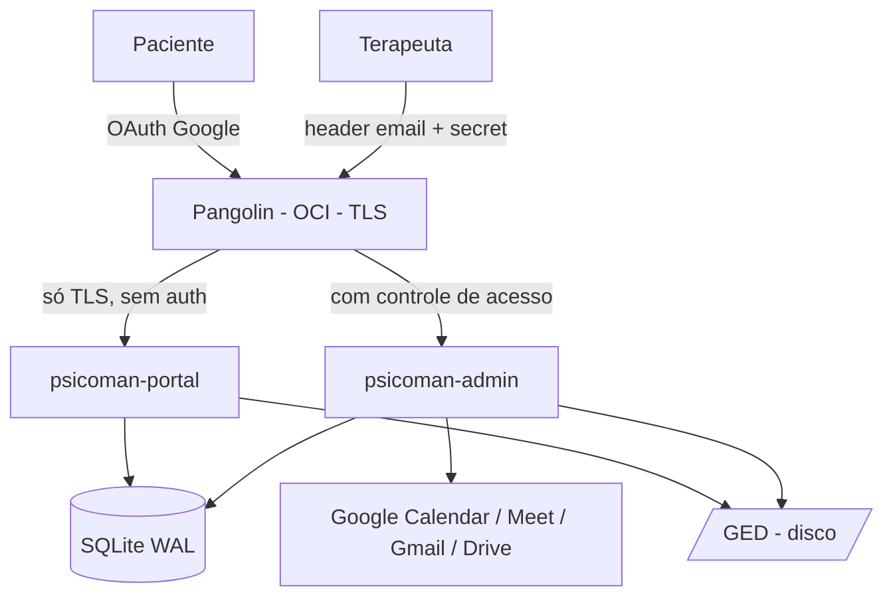

# Psicoman

Sistema de gestão de atendimentos para psicologia — pacientes, agenda, sessões, prontuário, financeiro e custos, com portal self-service para pacientes.

---

## Contexto

Um terapeuta precisa de uma ferramenta única para conduzir a operação do consultório: manter o cadastro dos pacientes, agendar sessões integradas ao Google Calendar/Meet, registrar o prontuário clínico, gerar cobranças, controlar custos e entender o retorno dos investimentos em plataformas de aquisição (ex: Doctoralia).

O Psicoman nasce como uma solução **simples, auto-contida e de baixa manutenção**, projetada para rodar em infraestrutura própria e segregada. Cada terapeuta que adotar o sistema recebe uma **instância isolada** (uma VM por terapeuta), preservando privacidade e a mesma arquitetura.

## Escopo

O escopo descrito na documentação corresponde ao **MVP**. Ideias futuras discutidas com a terapeuta ficaram deliberadamente fora desta versão.

**Dentro do escopo:**
- Perfil do terapeuta (nome, CRP, contatos, foto, bio, locais de atendimento, links de plataformas como Doctoralia/Zenklub/Terapy).
- Cadastro de pacientes (com origem de aquisição, email e CPF únicos) e locais de atendimento.
- Agenda integrada ao Google Calendar, com checagem de conflito (freebusy) antes de confirmar, Google Meet e notificações delegadas ao Google.
- Ciclo de vida de sessões (agendada → realizada / cancelada / falta) com controle explícito de cobrança e custo.
- Planos e pagamentos com gatilho de débito por tipo de plano (por sessão, por fechamento de ciclo, ou nunca no caso do atendimento social), geração idempotente, PDF de cobrança, quitação com comprovantes.
- Prontuário: anamnese, notas de sessão, notas livres e templates em Markdown.
- Controle de custos (local, CRP, infra, plataformas), rateio por sessão e ROI por canal de origem.
- Relatórios financeiros e de custos.
- Portal do paciente (self-service): login social Google (com vínculo por email a cadastro pré-existente), agenda aberta, pedido de agendamento, acompanhamento de sessões e débitos — com TLS e rate limiting próprios nas rotas públicas.
- GED (Gestão Eletrônica de Documentos) segregado por paciente, com integridade por hash.
- Backup diário cifrado no Google Drive, com restore.
- Observabilidade (logs, métricas, healthchecks), API versionada e documentada (Swagger).

**Fora do escopo (MVP):**
- Google Workspace / domínio próprio de email (upgrade opcional futuro).
- Vault externo para chaves (hoje via config, com interface plugável).
- Recursos avançados de Meet (gravação).
- Canais de notificação próprios além do Google Calendar.

## Atores

| Ator | Aplicação | Acesso |
|------|-----------|--------|
| Terapeuta | `psicoman-admin` | Total — atrás do gateway Pangolin (header de email + secret) |
| Paciente | `psicoman-portal` | Mínimo — login social Google; vê apenas seus próprios dados |

São **dois binários separados**, ambos atrás do Pangolin (que termina TLS/HTTPS para os dois). O Pangolin aplica controle de acesso só no admin; no portal ele só garante TLS, e a autenticação do paciente é feita na própria aplicação via login social Google. O portal não contém código administrativo nem acesso a dados clínicos.

## Arquitetura (visão rápida)



- **Backend em Go**, servindo também a interface web (HTML/CSS/JS embutido via `embed.FS`).
- **SQLite** local em modo WAL, compartilhado pelos dois binários.
- **GED** em pasta local, segregado por paciente, arquivos com hash SHA-256.
- **Integração Google** via OAuth 3-legged com refresh token (conta pessoal).
- Roda em **VM privada** (Proxmox no servidor X99); acesso externo via **Pangolin** (OCI), que termina TLS para as duas aplicações — com controle de acesso no admin e só TLS no portal.

Camadas: domínio (magro) → repositórios → serviços → integrações → API (HTTP) → web.

## Stack

- **Linguagem:** Go
- **Banco:** SQLite (WAL)
- **Front-end:** server-side render + framework CSS leve (Pico.css/Tailwind) + JS leve (htmx/Alpine), embutido no binário
- **Integrações:** Google Calendar, Meet, Gmail, Drive
- **Moeda:** BRL (valores em centavos) · **Timezone:** `America/Sao_Paulo`
- **IDs:** ULID em todas as entidades

## Documentação

| Documento | Natureza | Conteúdo |
|-----------|----------|----------|
| [`docs/requirements.md`](./docs/requirements.md) | Durável | Requisitos — o que o sistema faz e por quê |
| [`docs/architecture.md`](./docs/architecture.md) | Durável | Arquitetura — estrutura, modelo de dados, contratos, integrações, decisões |
| [`.kiro/specs/mvp/tasks.md`](./.kiro/specs/mvp/tasks.md) | Execução | Plano de implementação do MVP — 21 tasks em 7 fases, com dependências e rastreabilidade |

**Organização da documentação:** documentos duráveis (requisitos e arquitetura) vivem em `docs/` e evoluem com o produto. O plano de execução vive em `.kiro/specs/mvp/` como artefato da primeira implementação (formato de spec do Kiro: `requirements.md` + `design.md` + `tasks.md`, os dois primeiros apontando para `docs/`). Cada nova feature ganha sua própria spec em `.kiro/specs/`.

## Estrutura do repositório (planejada)

```
psicoman/
├── cmd/admin/           # main do psicoman-admin
├── cmd/portal/          # main do psicoman-portal
├── internal/
│   ├── domain/          # entidades e tipos
│   ├── repository/      # sqlite + ged
│   ├── service/         # regras de negócio
│   ├── integration/     # google (calendar, gmail, drive, oauth)
│   ├── api/             # rotas admin/portal + middleware
│   ├── web/             # templates e assets embutidos
│   ├── config/          # carregamento de config
│   ├── platform/        # logger, metrics, ulid, crypto
│   └── migration/       # migrations versionadas
├── migrations/          # .sql versionados
├── api/                 # openapi/swagger
├── test/e2e/            # testes end-to-end
├── config.example.yaml
└── Makefile
```

> A estrutura acima reflete a arquitetura; o código é construído incrementalmente conforme [`.kiro/specs/mvp/tasks.md`](./.kiro/specs/mvp/tasks.md).

## Build e execução

> O projeto está em fase de especificação. Os comandos abaixo refletem o alvo do `Makefile` definido no design.

```bash
# compilar os dois binários
make build

# testes
make test        # unit
make e2e         # end-to-end

# aplicar migrations
make migrate
```

Configuração por instância via `config.yaml` (baseado em `config.example.yaml`): paths de SQLite/GED/logs, email e secret do admin, credenciais OAuth Google, chave de cifragem, intervalos de lembrete e portas.

## Segurança e privacidade

- Dados de prontuário são dados sensíveis de saúde: infra segregada e permissionada, audit log de operações sensíveis, backup cifrado.
- Admin com defense in depth (não confia apenas no Pangolin).
- Portal isolado, sem acesso a dados clínicos; paciente enxerga só os próprios dados. Fica atrás do Pangolin (que garante TLS) mas sem o controle de acesso do gateway, então tem autenticação própria (login social) e rate limiting nas rotas públicas (cadastro, pedido de agendamento).
- Refresh tokens e backups cifrados (AES-GCM).

## Steering (padrões para o desenvolvimento)

Além dos steerings globais do usuário (Go, Docker, Git), o workspace tem steerings específicos do Psicoman em `.kiro/steering/`, carregados automaticamente por tipo de arquivo:

| Steering | Aplica-se a | Conteúdo |
|----------|-------------|----------|
| `psicoman-golang.md` | `**/*.go` | Camadas, regra de dependência, ULID/dinheiro/tempo/idempotência, contrato de API |
| `psicoman-sqlite.md` | `**/*.sql`, `repository/sqlite/**`, `migrations/**` | WAL, convenções de schema, migrations append-only |
| `psicoman-google-api.md` | `integration/google/**` | OAuth 3-legged, escopos mínimos, freebusy, backup no Drive |
| `psicoman-seguranca-lgpd.md` | `api/**`, `service/**`, `platform/crypto/**`, `config/**` | Defense in depth, TLS/rate limit do portal, segredos, audit log |
| `psicoman-web-responsivo.md` | `web/**`, `*.html`, `*.css` | Stack SSR + htmx/Alpine, mobile-first, WCAG AA |
| `psicoman-testes-e2e.md` | `test/e2e/**`, `*_test.go` | Fluxos mínimos exigidos, mocks do Google, critério de "task concluída" |

## Auditoria de prontidão

A spec passou por uma revisão de coerência antes do início da implementação. Problemas encontrados e já corrigidos nos três documentos:

- **Conflito de agenda**: a spec original previa ler o Calendar para evitar choque de horário; isso havia se perdido na reescrita e foi restaurado (`docs/requirements.md §3.3`, checagem via freebusy antes de confirmar sessão).
- **Cobrança de plano fechado**: o gatilho de débito não cobria `plano_fechado_mensal`/`trimestral` (que cobra por ciclo, não por sessão) nem impedia geração indevida para `atendimento_social`. Formalizado um gatilho por tipo de plano, incluindo um job de fechamento de ciclo (`docs/architecture.md §4.1.1`).
- **Duplicidade de paciente**: sem regra de unicidade de email/CPF nem de vínculo entre cadastro feito pelo terapeuta e cadastro feito pelo próprio paciente no portal. Corrigido com `UNIQUE` no schema e upsert por email.
- **TLS e rate limiting do portal**: o portal fica atrás do Pangolin (que termina TLS para as duas aplicações) mas sem o controle de acesso do gateway; faltava definir a autenticação (login social na aplicação) e como mitigar abuso nas rotas públicas (rate limiting). Definido em `docs/architecture.md §8`.
- **Plano de execução**: o grafo de dependências do `tasks.md` estava incompleto (a Task 20 declarava depender de várias tasks sem que o grafo cobrisse todos os caminhos); corrigido e a matriz de rastreabilidade requisito→task atualizada.

Não foram encontrados outros bloqueadores. A spec está consistente entre `requirements.md`, `architecture.md` e `tasks.md`, e pronta para o início da implementação.

## Status

Especificação auditada e consolidada. Próximo passo: iniciar a implementação pela Fase 0 (fundação e esqueleto dos dois binários), conforme [`.kiro/specs/mvp/tasks.md`](./.kiro/specs/mvp/tasks.md).
