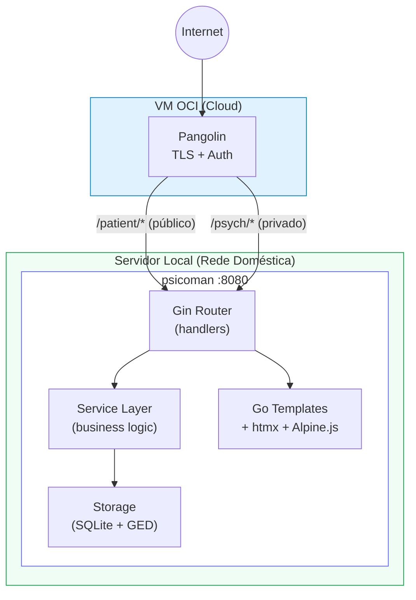
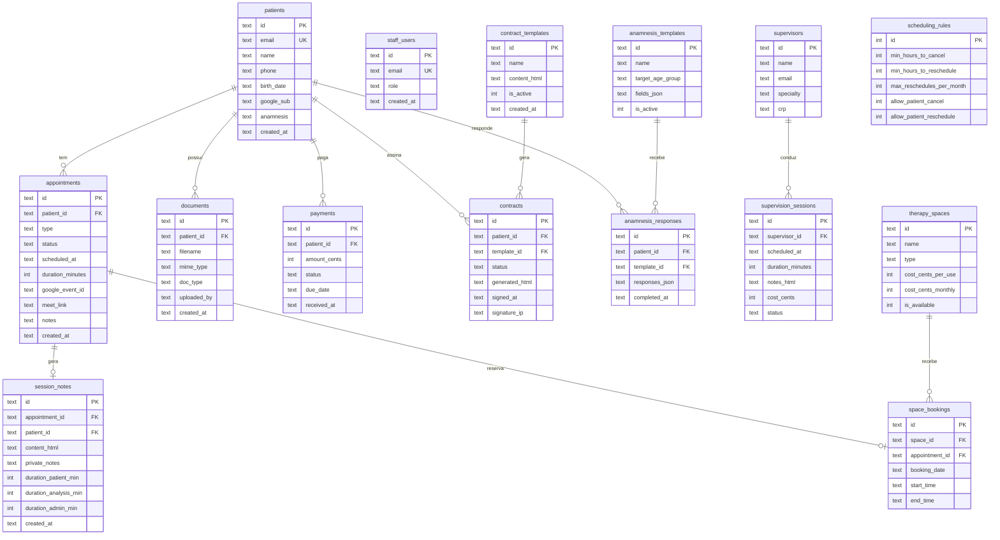
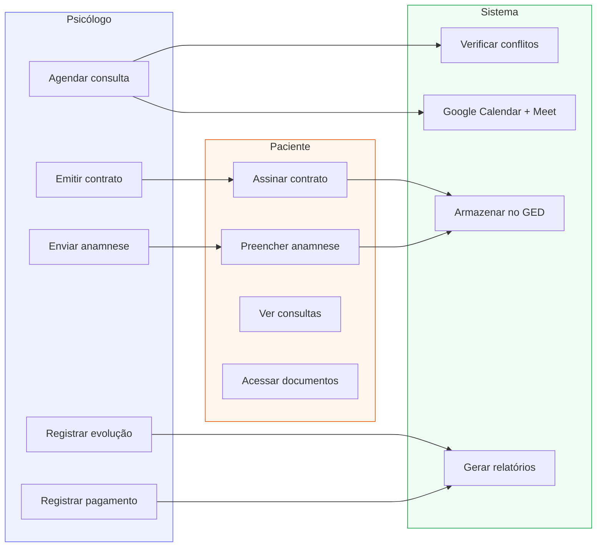

# Psicoman

Sistema de gestão clínica para psicólogos — monolito Go auto-contido, sem dependências externas em runtime.

---

## O que é

Psicoman é um sistema completo para psicólogos autônomos gerenciarem seu consultório. Um único binário Go serve a interface web e a API, usando SQLite como banco e htmx para interatividade — sem Node.js, sem npm, sem React.

Casos de uso em linguagem simples:
- **Psicólogo** acessa pelo navegador, vê agenda do dia, cadastra pacientes, registra evoluções, envia contratos e anamneses
- **Paciente** acessa com login Google, preenche anamnese, assina contrato, vê próximas consultas e documentos
- **Sistema** detecta conflitos de horário, integra com Google Calendar/Meet, gera relatórios financeiros

---

## Arquitetura



| Camada | Tecnologia |
|--------|-----------|
| Backend | Go 1.23, Gin, SQLite (modernc.org/sqlite, pure-Go) |
| Frontend | Go html/template, htmx 2.x, Alpine.js 3.x, CSS custom |
| Auth Paciente | Google OAuth2 → JWT local (7 dias) |
| Auth Psicólogo | Pangolin reverse proxy headers |
| Deploy | Docker (Alpine, ~20MB), Pangolin no host |
| Logs | zerolog + lumberjack (JSON, rotação diária, 90 dias) |
| Banco | SQLite com WAL, foreign keys, migrations automáticas |

---

## Modelo de dados



Relações principais:
- `patients` 1:N `appointments` (um paciente tem várias consultas)
- `appointments` 1:1 `session_notes` (uma evolução por consulta)
- `patients` 1:N `documents` (documentos do paciente)
- `patients` 1:N `payments` (pagamentos do paciente)
- `patients` 1:N `contracts` (contratos do paciente)
- `supervisors` 1:N `supervision_sessions` (sessões por supervisor)
- `therapy_spaces` 1:N `space_bookings` (reservas por espaço)

---

## Casos de uso



1. **Agendar consulta** — psicólogo cria consulta (online/presencial), sistema verifica conflitos, cria evento no Google Calendar com link Meet
2. **Cancelar/reagendar** — paciente ou psicólogo cancela respeitando regras configuráveis (horas mínimas, máximo de reagendamentos/mês)
3. **Registrar evolução** — após consulta, psicólogo registra notas clínicas + notas privadas + métricas de tempo
4. **Enviar anamnese** — psicólogo seleciona template (adulto/criança), paciente preenche online
5. **Firmar contrato** — psicólogo envia contrato com placeholders preenchidos, paciente assina digitalmente
6. **Gestão financeira** — registrar pagamentos, custos operacionais, gerar relatório mensal com saldo
7. **Upload de documentos** — laudos, notas fiscais, relatórios armazenados no GED por paciente
8. **Supervisão** — registrar supervisores, sessões, custos, acompanhar horas mensais
9. **Espaços** — cadastrar consultórios (fixos/alugados), controlar disponibilidade e custos

---

## Quick start

### Pré-requisitos

- Go 1.23+
- Docker + Docker Compose (opcional)

### Com Docker

```bash
make run
```

### Sem Docker

```bash
make run-api
```

Acesse:
- http://localhost:8080/psych — painel do psicólogo
- http://localhost:8080/patient/login — login do paciente

---

## Dados de teste

```bash
# Carregar dados de teste (servidor deve estar rodando com DEV_MODE=true)
bash scripts/seed-test-data.sh

# Limpar dados de teste
curl -X DELETE http://localhost:8080/api/dev/test-data -H "X-Dev-Auth: dev-local"
```

Cria 3 pacientes (TEST Ana, TEST Bruno, TEST Carla) com 12 consultas distribuídas no mês atual e anterior.

Convenção: nomes começam com "TEST " e emails usam @test.com — o endpoint de cleanup remove tudo que bate com essas regras.

Detalhes completos em [docs/testing.md](docs/testing.md).

---

## Variáveis de ambiente

| Variável | Padrão | Descrição |
|----------|--------|-----------|
| ADDR | :8080 | Endereço do servidor |
| DATA_DIR | ./data | Base para db, ged, logs |
| JWT_SECRET | change-me-in-production | Secret para JWT paciente |
| GOOGLE_CLIENT_ID | — | OAuth Client ID |
| GOOGLE_CLIENT_SECRET | — | OAuth Client Secret |
| DEV_MODE | — | true habilita rotas dev (NUNCA em prod) |
| DEV_SECRET | dev-local | Secret para X-Dev-Auth |

---

## Deploy

1. Gerar JWT_SECRET: `openssl rand -hex 32`
2. Configurar Google OAuth + Calendar API no Google Cloud Console
3. Configurar Pangolin com 2 endpoints (público + privado)
4. Não definir DEV_MODE (ou definir como false)
5. Montar volumes: `data/db`, `data/ged`, `data/logs`

```bash
docker compose up -d --build
```

---

## Makefile

| Target | Descrição |
|--------|-----------|
| `make build` | Compila binário Go em `bin/psicoman` |
| `make run` | Docker Compose dev (foreground) |
| `make run-bg` | Docker Compose dev (background) |
| `make stop` | Para o compose dev |
| `make run-api` | Build + run local com .env.dev |
| `make test` | `go test ./... -count=1` |
| `make clean` | Remove `bin/` e `data/` |

---

## Estrutura do projeto

```
psicoman/
├── cmd/server/main.go          # Entrypoint
├── internal/
│   ├── domain/                 # Regras de negócio puras (scheduling)
│   ├── service/                # Lógica de aplicação (appointments, auth, finance...)
│   ├── storage/                # Acesso a dados (SQLite queries)
│   │   └── migrations/        # SQL migrations (001-006)
│   └── web/
│       ├── handlers_*.go       # HTTP handlers por domínio
│       ├── pages_*.go          # Page renderers (templates)
│       ├── router.go           # Definição de rotas Gin
│       ├── middleware.go       # Auth, CORS, security headers
│       ├── static/             # CSS + JS (htmx, Alpine)
│       └── templates/          # Go HTML templates
│           ├── layouts/        # Base, psych, patient
│           ├── psych/          # Páginas do psicólogo
│           └── patient/        # Páginas do paciente
├── scripts/                    # Seed e utilitários
├── data/                       # Runtime: db, ged, logs
├── docs/                       # Documentação
├── Dockerfile                  # Build multi-stage
├── docker-compose.yml          # Produção
├── docker-compose.dev.yml      # Override dev
└── Makefile                    # Atalhos de desenvolvimento
```

---

## Documentação

- [docs/release-notes.md](docs/release-notes.md) — Features implementadas (v0.9)
- [docs/next-steps.md](docs/next-steps.md) — Roadmap e bugs conhecidos
- [docs/testing.md](docs/testing.md) — Guia de testes e dados de teste
