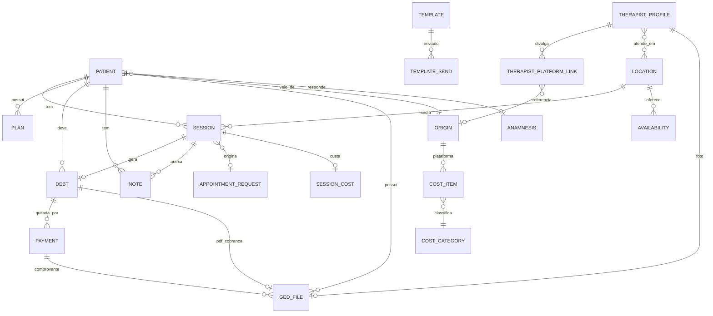
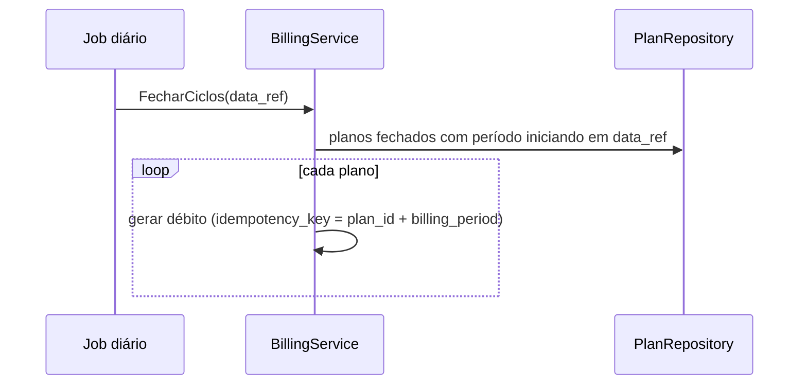
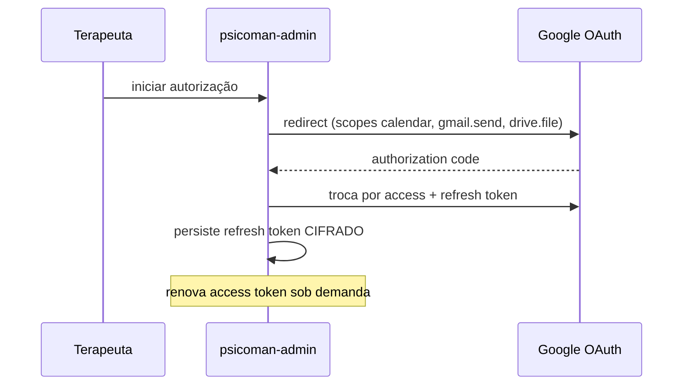

# Psicoman — Documento de Design
# Psicoman — Arquitetura

Design técnico da plataforma. Complementa [`requirements.md`](./requirements.md) (requisitos) e antecede [`../.kiro/specs/mvp/tasks.md`](../.kiro/specs/mvp/tasks.md) (plano de implementação).

---

## 1. Objetivo e Escopo

Detalhar as decisões de arquitetura, o modelo de dados, os contratos de API, as integrações e os componentes internos que realizam os requisitos de [`requirements.md`](./requirements.md). Resolve os pontos que estavam em aberto na especificação (localização do domínio de custos, backup do GED, gestão da chave de cifragem).

---

## 2. Estrutura do Repositório

Monorepo Go, dois binários compartilhando o núcleo de domínio/serviços/repositórios.

```
psicoman/
├── cmd/
│   ├── admin/           # main do psicoman-admin
│   └── portal/          # main do psicoman-portal
├── internal/
│   ├── domain/          # entidades e tipos (domínio magro)
│   ├── repository/
│   │   ├── sqlite/      # implementação SQL
│   │   └── ged/         # implementação do GED (disco + metadados)
│   ├── service/         # inteligência de negócio
│   ├── integration/
│   │   ├── google/      # calendar, meet, gmail, drive, oauth
│   │   └── ...
│   ├── api/
│   │   ├── admin/       # handlers e rotas do admin
│   │   ├── portal/      # handlers e rotas do portal
│   │   └── middleware/  # auth, logging, timing, recover
│   ├── web/
│   │   ├── admin/       # templates + assets embutidos (embed.FS)
│   │   └── portal/
│   ├── config/          # carregamento e validação de config
│   ├── platform/
│   │   ├── logger/      # níveis + rotação diária
│   │   ├── metrics/
│   │   ├── ulid/        # gerador compartilhado
│   │   └── crypto/      # cifragem de tokens e backup
│   └── migration/       # migrations versionadas
├── migrations/          # arquivos .sql versionados
├── api/                 # openapi/swagger
├── test/e2e/            # testes end-to-end
├── config.example.yaml
├── Makefile
└── go.mod
```

**Regra de dependência (interna → externa):** `domain` não importa ninguém; `repository`/`service`/`integration` importam `domain`; `api` importa `service`; `web` é servido por `api`. Sem ciclos.

---

## 3. Modelo de Dados (SQLite)

Convenções: PK `id TEXT` (ULID), timestamps `created_at`/`updated_at` em `TEXT` ISO-8601 no fuso `America/Sao_Paulo`, valores monetários em `INTEGER` (centavos, BRL). Soft-delete via `deleted_at` onde aplicável.

### 3.1 Diagrama de entidades



### 3.2 Entidades principais

**patient** — nome, telefone, email (obrigatórios, `email` UNIQUE); cpf (opcional, `cpf` UNIQUE quando não nulo); origin_id; created_at/updated_at.
- Regra: emissão de recibo/Receita Saúde exige `cpf` não nulo.
- Regra: cadastro via portal com email já existente vincula ao `patient` existente (upsert por email), nunca duplica.

**origin** — canal de aquisição (Doctoralia, indicação, etc.). Pode ligar-se a `cost_item` (plataforma paga) para cálculo de ROI.

**location** — nome, endereço, modalidade (`presencial`|`online`), cost_amount (centavos), cost_period (`por_sessao`|`diario`|`mensal`|`anual`).

**availability** — location_id, dia da semana / janela, capacidade. Base para as lacunas de agenda do portal.

**appointment_request** — patient_id, slot solicitado, status (`pendente`|`confirmado`|`recusado`). Registro interno; não toca o Google até confirmação.

**session** — patient_id, location_id, modalidade, início/fim, status (`solicitada`|`agendada`|`realizada`|`cancelada`|`falta`), flags `bill` (haverá cobrança) e `consider_cost` (considerar custos), google_event_id, meet_url.

**plan** — patient_id, tipo (`pagamento_por_consulta`|`pagamento_por_mes`|`plano_fechado_mensal`|`plano_fechado_trimestral`|`atendimento_social`), valor (centavos, quando fixo), vigência.

**debt** — patient_id, session_id (nullable — nulo para débitos de plano fechado), billing_period (nullable — `YYYY-MM` ou `YYYY-Q` quando aplicável), amount, due_date, status (`aberto`|`pago`|`parcial`), `idempotency_key` (UNIQUE) para geração idempotente. Composição da chave de idempotência por tipo de plano:
  - `pagamento_por_consulta`/`pagamento_por_mes`: `idempotency_key = session_id`.
  - `plano_fechado_mensal`/`plano_fechado_trimestral`: `idempotency_key = plan_id + billing_period` (job de fechamento de ciclo, não a finalização da sessão).
  - `atendimento_social`: nunca gera `debt` — validado na camada de serviço antes de qualquer geração.

**payment** — debt_id, amount, paid_at, método.

**session_cost** — session_id, amount atribuído, método de cálculo (`direto`|`rateio`), snapshot da base do rateio (auditável).

**cost_category** / **cost_item** — categorias (`local`|`crp`|`infra`|`plataforma`) e itens com valor + período. CRP anual, infra (Google), plataformas (Doctoralia). `cost_item` de plataforma referencia `origin`.

**anamnesis** — patient_id, conteúdo, atualizada por template/respostas.

**note** — patient_id, session_id (nullable → nota livre), conteúdo, created_at (ordenação sempre por created_at).

**template** — nome, corpo Markdown. **template_send** — template_id, patient_id, versão renderizada (HTML), enviado_em.

**ged_file** — patient_id, session_id/debt_id/payment_id (vínculo opcional), path relativo no GED, mime, size, `sha256` (integridade + dedup), created_at.

**google_token** — refresh_token cifrado, escopos, expiry do access token (renovado em runtime).

**audit_log** — actor (email), ação, entidade, entity_id, timestamp, metadados. Para operações sensíveis (prontuário, débito, config, backup/restore).

**therapist_profile** — um registro por instância. nome, crp, email, contatos, bio; foto e demais arquivos via `ged_file`. Relaciona-se com `location` (locais onde atende) e com `origin` (plataformas de perfil, reaproveitando a origem quando ela também é canal de aquisição).

**therapist_platform_link** — profile_id, label, url, origin_id (nullable — preenchido quando o link corresponde a uma `origin`/`cost_item` de plataforma). Evita duplicar Doctoralia/Zenklub/Terapy já modelados como origem/custo.

**schema_migration** — versão aplicada.

> **Ponto de aberto resolvido (custos):** custos moram em `cost_category` + `cost_item` como domínio próprio; `session_cost` materializa a atribuição por sessão (direto ou rateio) com snapshot auditável.

---

## 4. Design de Componentes

### 4.1 Ciclo de vida da sessão e efeitos financeiros/custo

```mermaid
sequenceDiagram
    participant T as Terapeuta
    participant API as API Admin
    participant S as SessionService
    participant F as BillingService
    participant C as CostService
    participant G as GoogleCalendar

    T->>API: confirmar sessão
    API->>S: Agendar
    S->>G: consultar disponibilidade (freebusy) do horário
    G-->>S: livre | conflito
    alt conflito
        S-->>API: erro 409 (conflito de agenda)
    else livre
        S->>G: criar evento + Meet + convidado
        G-->>S: event_id, meet_url
        S-->>API: sessão agendada
    end

    T->>API: marcar Realizada (bill=true, consider_cost=true)
    API->>S: Finalizar(flags)
    Note over S,F: plano por sessão -> gera débito agora; plano fechado -> não gera aqui (ver 4.1.1)
    S->>F: gerar débito se aplicável (idempotency_key=session_id)
    F-->>S: débito (ou existente)
    S->>C: atribuir custo (direto/rateio)
    C-->>S: session_cost
    S-->>API: OK
```

- **Checagem de conflito:** antes de criar/mover um evento, o `SessionService` consulta o Calendar (`freebusy`) do terapeuta para o horário pretendido. Cobre também compromissos não criados pelo Psicoman. Conflito bloqueia a confirmação (HTTP 409, mensagem PT-BR).
- **Idempotência do débito (planos por sessão):** `INSERT ... ON CONFLICT(idempotency_key) DO NOTHING`; segunda chamada não duplica.
- **Rateio (custo `diario`/`mensal`/`anual`):** `custo_periodo / nº_sessões_realizadas_no_local_no_periodo`. Recalculado ao fechar o período; `session_cost` guarda o valor no momento + base usada para auditoria.

### 4.1.1 Fechamento de ciclo — planos fechados

Para `plano_fechado_mensal`/`plano_fechado_trimestral`, o débito não nasce da finalização de uma sessão, e sim de um **job de fechamento de ciclo** (cron diário que verifica planos cuja vigência de período iniciou):



- `atendimento_social` nunca passa por este fluxo nem pelo fluxo de sessão: o `BillingService` recusa explicitamente gerar `debt` para esse tipo de plano.

### 4.2 GED

- Layout em disco: `<ged_root>/<patient_id>/<ulid_do_arquivo>` (segregação por paciente).
- Escrita: grava arquivo, calcula SHA-256, persiste `ged_file`. Dedup por hash dentro do paciente.
- Leitura: valida hash antes de servir (integridade).

### 4.3 Integração Google (OAuth 3-legged)



- Sem domain-wide delegation (conta pessoal). Refresh token cifrado com a chave do config (`platform/crypto`).
- Falha de refresh → sinaliza reautorização necessária (estado exposto no healthcheck/UI).

### 4.4 Backup/Restore

- Job diário: `VACUUM INTO` snapshot do SQLite → compacta (gzip) → cifra (AES-GCM, chave do config) → upload Drive (`drive.file`).
- **GED (ponto em aberto resolvido):** backup incremental — snapshot lista `ged_file` (path+sha256); envia ao Drive apenas arquivos cujo hash ainda não foi backupeado (manifesto no Drive). Evita reenviar o acervo inteiro diariamente.
- Restore: baixa snapshot do Drive, decifra, descompacta, valida integridade, substitui base (com backup de segurança da atual).
- **Chave de cifragem (ponto em aberto):** MVP lê do config; interface `KeyProvider` abstrai a fonte para permitir vault futuro sem mudar o resto.

### 4.5 Autenticação

Ambas as aplicações ficam atrás do Pangolin, que termina TLS. O Pangolin aplica controle de acesso apenas no admin.

- **Admin:** atrás do Pangolin **com** autenticação. O middleware valida header de email (Pangolin) == email admin do config, e header secret == secret do config. Falha → 401/403 com mensagem PT-BR + audit log.
- **Portal:** atrás do Pangolin **sem** controle de acesso (só TLS/HTTPS). A autenticação é da aplicação: OAuth Google login → sessão assinada (cookie httpOnly/JWT). Handlers filtram por email verificado; nenhum acesso a dados clínicos. Como o Pangolin não filtra acesso aqui, as rotas públicas (cadastro, pedido de agendamento) têm rate limiting próprio.

---

## 5. Contrato de API

- Prefixo versionado `/v1`. Namespaces `/v1/admin/*` e `/v1/portal/*`.
- Envelope padrão em toda resposta:

```json
{ "message": "texto PT-BR", "elapsed_ms": 12, "data": {}, "error": null }
```

- Middleware chain: `recover → request-id → timing → logging → auth → handler`.
- `timing` mede e injeta `elapsed_ms`. Erros mapeados para HTTP coerente (400/401/403/404/409/422/500) com `message` PT-BR.

### 5.1 Rotas admin (resumo)

| Método | Rota | Descrição |
|--------|------|-----------|
| GET | `/v1/admin/me` | Terapeuta autenticado |
| GET/PUT | `/v1/admin/profile` | Perfil do terapeuta (nome, CRP, contatos, foto, bio, locais, links de plataformas) |
| CRUD | `/v1/admin/patients` | Pacientes |
| CRUD | `/v1/admin/locations` | Locais |
| CRUD | `/v1/admin/plans` | Planos por paciente |
| GET/POST | `/v1/admin/sessions` | Sessões e transições de estado (checa conflito via freebusy do Calendar antes de confirmar) |
| POST | `/v1/admin/sessions/{id}/finish` | Finalizar (flags bill/consider_cost) |
| GET/POST | `/v1/admin/appointment-requests` | Pedidos pendentes / confirmar |
| CRUD | `/v1/admin/debts` | Débitos; PDF de cobrança |
| POST | `/v1/admin/debts/{id}/pay` | Quitar (anexa comprovante) |
| CRUD | `/v1/admin/notes` | Notas (sessão/livres) |
| CRUD | `/v1/admin/anamnesis` | Anamnese |
| CRUD | `/v1/admin/templates` | Templates Markdown; envio |
| CRUD | `/v1/admin/costs` | Categorias/itens de custo |
| GET | `/v1/admin/reports/financial` | Relatórios financeiros |
| GET | `/v1/admin/reports/costs` | Custos anual/mensal/paciente |
| GET | `/v1/admin/reports/roi` | ROI por canal |
| POST | `/v1/admin/google/authorize` | Iniciar OAuth |
| POST | `/v1/admin/backup` / `/restore` | Backup/restore manual |

### 5.2 Rotas portal (resumo)

| Método | Rota | Descrição |
|--------|------|-----------|
| GET | `/v1/portal/me` | Perfil do paciente logado |
| PUT | `/v1/portal/me` | Cadastro básico (nome, cpf, email, telefone) |
| GET | `/v1/portal/availability` | Lacunas de agenda abertas |
| POST | `/v1/portal/appointment-requests` | Solicitar sessão |
| GET | `/v1/portal/sessions` | Minhas sessões |
| GET | `/v1/portal/debts` | Meus débitos (pendentes/pagos) e comprovantes |

- Swagger/OpenAPI em `/v1/swagger` (ambos os binários, escopo por namespace).
- Saúde/observabilidade: `/healthz`, `/readyz`, `/livez`, `/metrics`.

---

## 6. Observabilidade

- **Logger** com níveis (debug/warn/info/error) e rotação diária (por data). Structured logging (JSON) com request-id.
- **Métricas**: latência por rota, contagem por status, débitos gerados, jobs de backup, falhas de refresh Google.
- **Healthchecks**: `readyz` inclui checagem do SQLite e da validade do token Google (reautorização pendente = degraded).

---

## 7. Estratégia de Testes

- **Unit**: serviços (regras de cobrança/rateio/idempotência), crypto, ULID, config.
- **E2E** (`test/e2e/`): sobem o binário com SQLite temporário e Google mockado; cobrem fluxos ponta a ponta (cadastro → sessão → débito → quitação; pedido → confirmação → evento; backup → restore).
- Google/Gmail/Drive por trás de interfaces, com fakes nos testes.

---

## 8. Configuração e Deploy

- `config.yaml` por instância: paths (SQLite, GED, logs), email admin, secret admin, credenciais OAuth Google, chave de cifragem (backup + tokens), intervalos de lembrete, endpoint/porta de cada binário.
- `Makefile`: `build` (dois binários), `test`, `e2e`, `lint`, `migrate`.
- Deploy: uma VM por terapeuta (Proxmox/X99). Ambos os binários ficam atrás do Pangolin (OCI): o admin com controle de acesso do Pangolin, o portal com o Pangolin só terminando TLS. A autenticação do portal é da própria aplicação (login social Google).
- **TLS:** terminado no Pangolin para as duas aplicações — o binário não precisa gerenciar certificado. Se em algum cenário o portal for exposto fora do Pangolin, aí sim seria preciso TLS próprio (fora do escopo atual).
- **Rate limiting do portal:** middleware de rate limit (por IP e por email) nas rotas `/v1/portal/register` e `/v1/portal/appointment-requests`, únicas rotas públicas sem autenticação prévia — necessário porque o Pangolin não aplica controle de acesso no portal.

---

## 9. Decisões e Trade-offs

| Decisão | Escolha | Motivo |
|---------|---------|--------|
| Dois binários | admin + portal separados | Segrega superfície de ataque e blast radius |
| Storage | SQLite WAL compartilhado | Simplicidade; portal quase só lê |
| OAuth | 3-legged + refresh token | Conta pessoal não tem domain-wide delegation |
| Front-end | SSR + Pico/Tailwind + htmx/Alpine | Moderno com pouco JS, sem build de SPA |
| Custos | domínio próprio + `session_cost` | Auditabilidade do rateio |
| Backup GED | incremental por hash | Evita reenvio do acervo inteiro |
| Chave de cifragem | config + interface `KeyProvider` | MVP simples, vault plugável no futuro |
