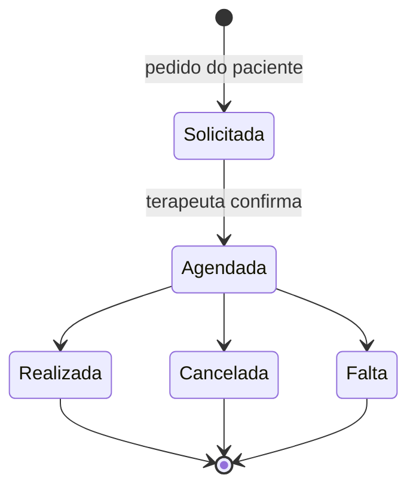

# Psicoman — Requisitos

Especificação de requisitos da plataforma de gestão de atendimentos para psicologia. Escopo aqui descrito = **MVP**.

> Este documento responde **o quê** e **por quê**. O **como** está em [`architecture.md`](./architecture.md); o **plano de implementação** em [`.kiro/specs/mvp/tasks.md`](../.kiro/specs/mvp/tasks.md); a **visão geral** em [`../README.md`](../README.md).

---

## 1. Visão Geral

Plataforma para um terapeuta gerenciar pacientes, agenda, sessões, prontuário, financeiro e custos, com um portal self-service para pacientes agendarem e acompanharem seus atendimentos.

- Backend em Go, SQLite local, GED (Gestão Eletrônica de Documentos) em pasta local.
- Integração com Google (Calendar, Meet, Gmail, Drive).
- Roda em VM privada (Proxmox no servidor X99), acesso externo do admin via gateway Pangolin (OCI).
- Cada terapeuta recebe uma instância isolada (uma VM por terapeuta).

---

## 2. Atores e Acesso

| Ator | Aplicação | Pangolin | Autenticação | Escopo |
|------|-----------|----------|--------------|--------|
| Terapeuta | admin | Com controle de acesso (TLS + auth) | Header de email (via Pangolin) + secret | Acesso total |
| Paciente | portal | Só TLS, sem controle de acesso | Login social Google (na própria aplicação) | Mínimo: próprio perfil, agenda aberta, solicitar sessão, ver suas sessões e débitos |

Requisitos:
- O terapeuta e o paciente têm aplicações e mecanismos de autenticação **separados**; o acesso do paciente nunca alcança dados clínicos nem funções administrativas.
- Ambas as aplicações ficam atrás do Pangolin (que garante TLS/HTTPS). O Pangolin aplica controle de acesso **apenas** no admin; no portal ele só termina TLS, e a autenticação é responsabilidade da aplicação (login social Google).
- O paciente só enxerga dados vinculados ao seu email verificado.
- O acesso administrativo não pode depender apenas do gateway estar presente (defense in depth).

> Realização técnica (binários, middleware, sessão): `architecture.md §2, §4.5`.

---

## 3. Requisitos Funcionais

### 3.1 Cadastro de Pacientes

- Obrigatórios: **nome, telefone, email**.
- **CPF opcional** — sem CPF **não é possível emitir recibo nem Receita Saúde** (a operação é bloqueada com mensagem em PT-BR).
- Cada paciente tem **ID único (ULID)** referenciado em todo o sistema.
- Cada paciente tem uma **origem** (canal de aquisição: Doctoralia, indicação, etc.), base para o cálculo de ROI.
- Cadastro pode ser iniciado pelo terapeuta (completo) ou pelo próprio paciente no portal (dados básicos); o terapeuta complementa os dados clínicos.
- **Email é único** por paciente. **CPF, quando informado, também é único.**
- Se o paciente se cadastra no portal com um email que já corresponde a um paciente existente (cadastrado pelo terapeuta), o sistema **vincula ao registro existente** em vez de criar um duplicado.

#### 3.1.1 Aprovação de acesso ao portal (gate)

Como o portal fica exposto na internet e o Pangolin não aplica controle de acesso (§4.1), todo paciente tem um **estado de aprovação**: `pendente`, `aprovado` ou `rejeitado`.

- Auto-cadastro pelo portal nasce **`pendente`**; cadastro feito pelo terapeuta nasce **`aprovado`** (o terapeuta é a autoridade de aprovação).
- Vínculo por email não rebaixa: se o email já é de um paciente `aprovado`, o auto-cadastro mantém `aprovado`.
- Enquanto `pendente`/`rejeitado`, o paciente **não acessa nenhum recurso** do portal (agenda, pedidos, sessões, débitos, edição de perfil). Só pode consultar o próprio estado e sair. O bloqueio é imposto **no servidor** (HTTP 403), não só na UI.
- O terapeuta tem uma **fila de aprovação** no admin (com contagem destacada) para aprovar/rejeitar; aprovar/rejeitar registram **audit log**. Aprovar libera o acesso imediatamente.
- Persistido por migration aditiva (registros pré-existentes → `aprovado`, idempotente).

### 3.2 Locais de Atendimento

- Cada local tem nome, endereço, modalidade (presencial ou online) e **custo** com periodicidade (`por_sessao`, `diario`, `mensal`, `anual`).
- Cada local tem **disponibilidade de agenda** (janelas de atendimento), base para as lacunas ofertadas ao paciente.

### 3.3 Agenda e Sessões

- O **Google Calendar é a fonte da verdade** dos compromissos; o sistema lê e escreve nele.
- Antes de confirmar uma sessão (agendamento direto pelo terapeuta ou confirmação de um pedido do paciente), o sistema **consulta o Calendar** para verificar conflito de horário com outros compromissos do terapeuta (incluindo eventos não criados pelo Psicoman). Havendo conflito, a confirmação é bloqueada com mensagem PT-BR indicando o motivo.
- Ao efetivar uma sessão, o evento inclui o **paciente como convidado** e um link do **Google Meet**.
- **Notificações ao paciente são delegadas ao Google Calendar** (reminders do evento). Default: 1 dia antes + 30 min antes, acumulativos; os intervalos são configuráveis. O sistema não implementa canal de notificação próprio.
- **Fluxo de solicitação pelo paciente:** o paciente vê lacunas abertas e cria um **pedido de agendamento** (registro interno, nada toca o Google). O terapeuta vê os pedidos numa tela de pendências e, ao **confirmar**, o sistema cria o evento + Meet e efetiva a sessão.

**Ciclo de vida da sessão:**

- Ao mudar o estado (Realizada / Cancelada / Falta), o terapeuta decide **explicitamente** dois flags independentes:
  - **Haverá cobrança?** → gera ou não débito financeiro.
  - **Custos serão considerados?** → a sessão computa ou não custo de local/infra.

### 3.4 Planos e Pagamentos

Planos/acordos por paciente:

| Plano | Descrição |
|-------|-----------|
| `pagamento_por_consulta` | Pago por sessão realizada |
| `pagamento_por_mes` | Pós-pago: soma das sessões realizadas no mês (variável) |
| `plano_fechado_mensal` | Valor fixo mensal, independente do nº de sessões |
| `plano_fechado_trimestral` | Valor fixo trimestral |
| `atendimento_social` | Sem pagamento fixo |

- O **gatilho de geração do débito depende do tipo de plano**:
  - `pagamento_por_consulta` / `pagamento_por_mes`: **por sessão** — encerrar uma sessão com o flag de cobrança marcado gera uma **entrada de valor a receber (débito)**, de forma **idempotente** (uma sessão não gera dois débitos).
  - `plano_fechado_mensal` / `plano_fechado_trimestral`: **por ciclo de cobrança** — o débito do valor fixo é gerado automaticamente no início de cada período (mês/trimestre) vigente do plano, **independente do número de sessões realizadas**. A geração também é idempotente (um período não gera dois débitos para o mesmo plano).
  - `atendimento_social`: **nunca gera débito**, independente de qualquer flag marcado na sessão.
- Ao encerrar uma sessão faturável, o terapeuta informa a forma de pagamento conforme o plano do paciente (ou cadastra uma nova).
- O sistema gera um **PDF de cobrança**, armazenado no GED como lastro, com envio opcional por email ao paciente.
- O terapeuta pode **registrar o pagamento** quitando um débito e **anexar comprovantes** (que vão para o GED).
- **Recibos / Receita Saúde exigem CPF** do paciente.
- **Relatórios financeiros** (gerais ou por paciente): débitos gerados, débitos em aberto, valores recebidos, considerando atrasos.

### 3.5 Custos e ROI

Cadastro de custos: **local** (§3.2), **CRP** (anual), **infraestrutura** (Google, etc.), **plataformas** de aquisição (Doctoralia, etc.) com custo por período.

- **Custo por sessão / por paciente:** custo `por_sessao` é atribuído direto; custos `diario`/`mensal`/`anual` são **rateados proporcionalmente** entre as sessões realizadas no local no período. Objetivo: comparar o custo real de sessão online vs. presencial e subsidiar a precificação de cada paciente. A sessão só computa custo se o flag "considerar custos" estiver marcado.
- **ROI por canal de origem:** cruza a **receita gerada pelos pacientes de cada origem** com o **custo da plataforma correspondente** no período, respondendo se o investimento no canal tem retorno.
- **Relatórios de custo:** totais com visão anual, mensal ou por paciente.

### 3.6 Prontuário e Gestão de Atendimentos

- **Anamnese** e **controle terapêutico** por paciente.
- **Notas de sessão**: texto + anexos, vinculadas a uma sessão específica.
- **Notas livres**: sem vínculo com sessão (lembretes). Notas de sessão e livres sempre ordenadas por **data de criação**.
- **GED segregado por paciente**, isolando documentos.
- **Templates em Markdown** para enviar ao paciente (ex: anamnese); o envio usa sempre a versão **formatada**.

### 3.7 Integração Google

- Integrar com **Calendar/Meet** (agenda e sessões), **Gmail** (envio de cobranças/templates) e **Drive** (backup).
- Autorização única pelo terapeuta, com renovação automática de acesso sem reautorização recorrente.

> Realização técnica (OAuth 3-legged, escopos, refresh token cifrado): `architecture.md §4.3`.

### 3.8 Backup e Restore

- **Backup diário** da base, **cifrado e compactado**, armazenado no **Google Drive**.
- Capacidade de **restaurar** a base a partir de um backup.
- O GED também deve ser coberto pela estratégia de backup.

> Realização técnica (VACUUM, AES-GCM, backup incremental do GED, KeyProvider): `architecture.md §4.4`.

### 3.9 Perfil do Terapeuta

O terapeuta tem uma tela para inserir e editar seus próprios dados. Como cada instância atende um único terapeuta, há **um** perfil por instância.

- Dados: **nome**, **CRP** (número de registro profissional), **email**, **contatos** (telefone e outros), **foto**, **bio** (texto).
- **Locais de atendimento** associados ao terapeuta — associação com a entidade Local (§3.2), não um novo cadastro de endereço.
- **Links de plataformas** de perfil/conteúdo (Doctoralia, Zenklub, Terapy, etc.): rótulo + URL. Quando a plataforma também for uma origem de aquisição/custo (§3.5), o link pode referenciar essa origem, evitando cadastro duplicado.
- A foto e demais arquivos do perfil ficam no GED (área do próprio terapeuta, separada das pastas de pacientes).
- Dados públicos do perfil (nome, foto, bio) podem ser exibidos no portal do paciente; CRP, contatos e email seguem a política de exibição definida na UI (não são dados sensíveis de saúde, mas o telefone/email do terapeuta só aparecem onde fizer sentido).

> Realização técnica (entidade `therapist_profile`, relação com `location` e `origin`): `architecture.md §3.2`.

---

## 4. Requisitos Não-Funcionais

### 4.1 Segurança e Conformidade

- Infra segregada e permissionada por instância, acesso por chaves seguras.
- Prontuário é dado sensível de saúde: acesso segregado, **audit log** de operações sensíveis (prontuário, débitos, config, backup/restore), backups cifrados.
- Área do paciente isolada, sem acesso a dados clínicos.
- **Todo tráfego externo (admin e portal) é servido em HTTPS**, com TLS terminado no Pangolin. O admin fica atrás do Pangolin **com** controle de acesso (autenticação por email + secret); o portal fica atrás do Pangolin **sem** controle de acesso — o Pangolin garante apenas TLS/HTTPS, e a autenticação do paciente é feita pela própria aplicação via login social Google.
- **Rotas públicas do portal** (cadastro e pedido de agendamento) têm **rate limiting básico** (por IP e por email) para mitigar abuso, já que o Pangolin, no portal, não aplica controle de acesso.

### 4.2 Padrões de Domínio

- **ULID** em todas as entidades.
- **BRL** como única moeda; valores em centavos (inteiro).
- Fuso fixo **`America/Sao_Paulo`**.
- **Idempotência** na geração de débito.
- **GED com hash SHA-256** (integridade e deduplicação).

### 4.3 Observabilidade e Operação

- **Logs** com níveis (debug/warn/info/error) e **rotação diária**.
- **Métricas** e endpoints de **healthcheck, readiness, liveness**.
- **Config por arquivo**, para deploy seguro e segregação de ambientes.
- **Makefile** capaz de gerar os binários.
- **Testes E2E** cobrindo a solução, garantindo não-regressão.

### 4.4 API

- Toda resposta traz **mensagem em PT-BR** e **tempo de processamento em ms**, com código HTTP coerente.
- Rotas **versionadas**, seguindo boas práticas REST, com namespaces distintos para admin e portal.
- **Swagger** documentado, viabilizando uso por terceiros.

> Contrato detalhado (envelope, rotas, middleware): `architecture.md §5`.

### 4.5 Interface (UX)

- Moderna, limpa, leve, acolhedora e empática. Usuários com pouco conhecimento técnico: zero jargão, fluxos curtos, feedback claro em PT-BR.
- Paleta suave, tipografia legível, espaçamento generoso, ícones simples, **acessibilidade WCAG AA** (navegação por teclado, contraste, labels, foco visível).
- **Responsiva (mobile-first)**: portal do paciente prioriza mobile; admin funciona bem em desktop e mobile.

> Stack de front-end e realização técnica: `architecture.md §9`.

---

## 5. Fora do Escopo (MVP)

- Google Workspace / email de domínio próprio (upgrade futuro).
- Vault externo para chaves (hoje via config, com interface plugável).
- Recursos avançados de Meet (gravação).
- Canais de notificação próprios além do Google Calendar.

---

## 6. Glossário

| Termo | Significado |
|-------|-------------|
| GED | Gestão Eletrônica de Documentos — repositório de arquivos dos pacientes |
| ULID | Universally Unique Lexicographically Sortable Identifier |
| Pangolin | Gateway de gestão de acessos (OCI), à frente da aplicação admin |
| ROI por canal | Retorno sobre investimento por canal de aquisição de paciente |
| Receita Saúde | Emissão de recibo de serviços de saúde (exige CPF) |
