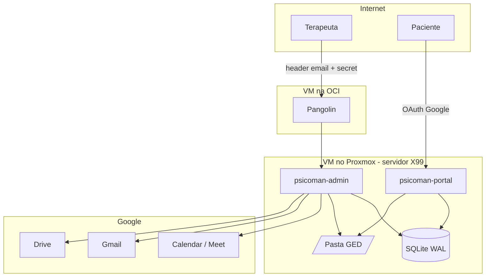
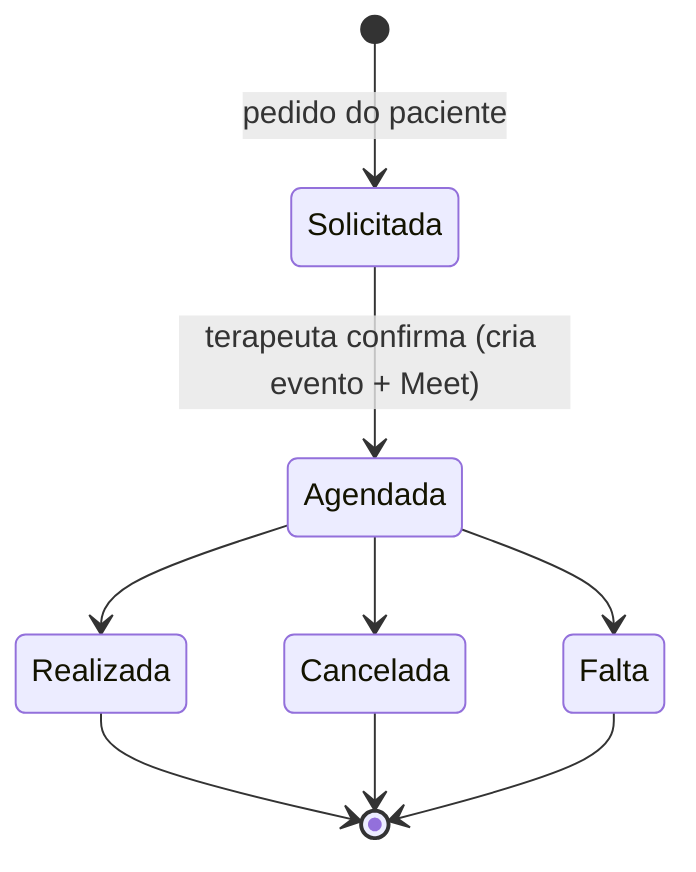

# Psicoman — Especificação Técnica

Sistema de gestão de atendimentos para psicologia.

> Documento de especificação que guia o desenvolvimento da plataforma. Escopo aqui descrito = MVP.

---

## 1. Visão Geral

Plataforma para um terapeuta gerenciar pacientes, agenda, sessões, prontuário, financeiro e custos, com um portal self-service para pacientes agendarem e acompanharem seus atendimentos.

- Backend em **Go**, **SQLite** local, **GED** (Gestão Eletrônica de Documentos) em pasta local.
- Integração com **Google** (Calendar, Meet, Gmail, Drive).
- Roda em **VM privada** (Proxmox no servidor físico X99), exposto à internet via gateway **Pangolin** (VM na OCI).
- Cada terapeuta que adotar o sistema recebe uma **instância isolada**, mantendo a mesma arquitetura (uma VM por terapeuta).

---

## 2. Atores e Acesso

| Ator | Binário | Autenticação | Escopo |
|------|---------|--------------|--------|
| Terapeuta | `psicoman-admin` | Pangolin injeta header com email do usuário logado + secret compartilhado em header | Acesso total: pacientes, agenda, sessões, prontuário, financeiro, custos, relatórios, config |
| Paciente | `psicoman-portal` | Login social Google (OAuth) + sessão própria (cookie/JWT). Fora do Pangolin | Acesso mínimo: cadastro básico do próprio perfil, ver agenda aberta, solicitar sessão, ver seus agendamentos/consultas e débitos (pendentes e pagos) |

### 2.1 Decisão de arquitetura — dois executáveis

`psicoman-admin` e `psicoman-portal` são **binários separados**. O portal é a única superfície exposta ao público; não contém código administrativo nem escrita ao prontuário. Segrega superfície de ataque, modelos de autenticação e blast radius de deploy.

### 2.2 Autorização do terapeuta

O `psicoman-admin` valida:
- **(a)** o header de email injetado pelo Pangolin contra o email admin configurado;
- **(b)** o secret em header contra o valor do config.

Ambos obrigatórios. **Defense in depth**: o admin não confia apenas no Pangolin estar na frente.

### 2.3 Autorização do paciente

O `psicoman-portal` autentica via **OAuth Google** (login social), escopo mínimo (`openid email profile`). O email verificado é a chave que vincula o paciente ao seu registro. O paciente só enxerga dados cujo `patient_id` corresponde ao seu email verificado.

---

## 3. Arquitetura

### 3.1 Camadas (domínio magro, orientado a domínios)

- **Domínio**: entidades e tipos, permeiam toda a solução. Domínio magro (pouca lógica na entidade, para simplicidade).
- **Repositórios (dados)**: conexão SQLite, implementação SQL, e implementação do GED (armazena arquivos em disco, grava metadados no SQLite).
- **Serviços**: inteligência de negócio; orquestra repositórios e integrações.
- **Integrações**: Google Calendar, Meet, Gmail, Drive.
- **API (HTTP)**: rotas, métodos, chama serviços.
- **Web (interface)**: HTML/CSS/JS embutido no binário (`embed.FS`), servido pelo próprio backend.

### 3.2 Storage compartilhado (topologia A)

Os dois binários compartilham o mesmo arquivo SQLite e a mesma pasta GED.

- SQLite em **WAL mode** para permitir leitura concorrente e escrita serializada entre processos.
- Escrita do portal é mínima (cadastro básico do paciente + pedido de agendamento); leitura predomina.
- `busy_timeout` configurado para lidar com contenção pontual de escrita.



### 3.3 Padrões técnicos

- **IDs**: ULID para **todas** as entidades.
- **Moeda**: BRL exclusivamente. Valores em **centavos** (inteiro) para evitar erro de ponto flutuante.
- **Timezone**: `America/Sao_Paulo` fixo. Todos os pacientes e sessões no fuso de São Paulo.
- **Idempotência**: geração de débito ao encerrar sessão é idempotente (chave por sessão), impedindo cobrança duplicada.
- **GED**: cada arquivo tem hash **SHA-256** (integridade + deduplicação). Metadados no SQLite, binário em disco segregado por paciente.
- **Audit log**: registro de acessos e operações sensíveis (leitura/escrita de prontuário, geração/quitação de débito, alteração de config).
- **Migrations**: versionamento de schema aplicado no boot.

---

## 4. Domínio Funcional

### 4.1 Cadastro de Pacientes

- Campos obrigatórios: **nome, telefone, email**.
- **CPF: opcional.** Sem CPF **não é possível emitir recibo nem Receita Saúde** (validação bloqueia essas operações e informa o motivo em PT-BR).
- **ID ULID** único, referenciado em todo o sistema.
- **Origem do paciente**: canal de aquisição (Doctoralia, indicação, etc.), usado para cálculo de ROI por canal.
- Cadastro pode ser criado pelo terapeuta (admin) ou pelo próprio paciente (portal, dados básicos: nome, CPF, email, telefone). O terapeuta complementa dados clínicos.

### 4.2 Locais de Atendimento (entidade unificada)

Unifica as menções de "local" (cadastro + custos) em uma entidade única:

- Nome, endereço, modalidade (`presencial` / `online`).
- **Custo**: valor + periodicidade (`por_sessao`, `diario`, `mensal`, `anual`).
- **Disponibilidade de agenda** por local (janelas de atendimento).

### 4.3 Agenda e Sessões

**Integração Google Calendar (fonte da verdade dos compromissos):**
- O Psicoman **escreve** no Google Calendar (fluxo unidirecional admin→Google).
- Ao confirmar uma sessão, cria evento no Calendar com: convidado (email do paciente) e link do **Google Meet**.
- **Notificações são 100% delegadas ao Google Calendar** (reminders do evento). O Psicoman **não** implementa scheduler próprio de notificação. Defaults de lembrete (**1 dia antes + 30 min antes**) configurados nos reminders do evento; o terapeuta pode ajustar os intervalos no config.

**Fluxo de solicitação pelo paciente (portal):**
1. Paciente vê lacunas de agenda aberta.
2. Paciente cria um **pedido de agendamento** — apenas um registro interno; nada toca o Google ainda.
3. Terapeuta vê os pedidos numa **tela de pendências**.
4. Ao **confirmar**, o Psicoman cria o evento + Meet no Calendar e efetiva a sessão.

**Ciclo de vida da sessão:**



Ao mudar o estado (Realizada / Cancelada / Falta), o terapeuta decide **explicitamente** dois flags independentes:
- **Haverá cobrança?** → gera ou não débito financeiro.
- **Custos serão considerados?** → a sessão computa ou não custo de local/infra.

Esses flags governam se a sessão gera lançamento financeiro e/ou custo atribuído.

### 4.4 Planos e Pagamentos

**Planos/acordos por paciente:**

| Plano | Descrição |
|-------|-----------|
| `pagamento_por_consulta` | Pago por sessão realizada |
| `pagamento_por_mes` | Pós-pago: soma das sessões realizadas no mês (variável) |
| `plano_fechado_mensal` | Valor fixo mensal, independente do nº de sessões |
| `plano_fechado_trimestral` | Valor fixo trimestral |
| `atendimento_social` | Sem pagamento fixo |

Distinção documentada: `pagamento_por_mes` é **variável** por sessão; `plano_fechado_mensal` é **valor fixo** independente de comparecimento.

**Geração de débito:**
- Ao encerrar (Realizada com flag de cobrança), gera **entrada de valor a receber**, de forma **idempotente** (uma sessão não gera dois débitos).
- No encerramento, o terapeuta informa a forma de pagamento conforme o plano do paciente, ou cadastra uma nova.
- Gera **PDF de cobrança**, armazena no **GED** (lastro). Envio por email ao paciente via Gmail API (opcional, quando disponível).

**Quitação:**
- Terapeuta registra pagamento, quitando um débito.
- Pode anexar **comprovantes** (vão para o GED).

**Recibos / Receita Saúde:**
- Exigem **CPF** do paciente. Sem CPF, operação bloqueada com mensagem clara em PT-BR.

**Relatórios financeiros** (gerais ou por paciente): débitos gerados, débitos em aberto, valores recebidos, considerando atrasos.

### 4.5 Custos e ROI

**Cadastro de custos:**
- Custo de local (na entidade Local — seção 4.2).
- **CRP** (anual).
- **Infraestrutura** (Google Cloud/Workspace, etc.).
- **Plataformas** de publicação/perfil (Doctoralia, etc.), com custo por período.

**Custo por sessão / por paciente (rateio proporcional):**
- Custo de local `por_sessao`: atribuído direto à sessão.
- Custo de local `diario`/`mensal`/`anual`: **rateado proporcionalmente** — custo do período ÷ nº de sessões realizadas naquele local no período, atribuído a cada sessão.
- Online: custo definido (pode ser 0 ou custo de infra rateado).
- Sessão só computa custo se o flag "considerar custos" estiver marcado (seção 4.3).
- Objetivo: comparar custo real de sessão online vs. presencial por local, insumo para precificar cada paciente.

**ROI por canal de origem (atribuição de receita por origem):**
- Modelo de **atribuição de receita por origem** em vez de rateio de centavos por paciente.
- Cada paciente tem uma origem; cada plataforma tem custo por período.
- Relatório cruza: **receita gerada pelos pacientes de origem X (período) × custo da plataforma X (período) = ROI do canal**.

**Relatórios de custo**: totais com visão anual, mensal ou por paciente.

### 4.6 Prontuário e Gestão de Atendimentos

- **Anamnese** por paciente.
- **Controle terapêutico** (acompanhamento).
- **Notas de sessão**: texto + anexos, vinculadas a uma sessão específica.
- **Notas livres**: notas do terapeuta sobre o paciente, sem vínculo com sessão (lembretes). Notas de sessão e livres sempre ordenadas por **data de criação**.
- **GED segregado por paciente**: pasta/prefixo por paciente, isolando documentos.
- **Templates em Markdown**: para enviar ao paciente (ex: formulário de anamnese). Ao enviar, o sistema envia a versão **formatada** (Markdown renderizado).

---

## 5. Integração Google (OAuth)

**Plano atual:** Google One AI Premium (conta pessoal) — **não é Workspace**. Consequências:

- **Sem domain-wide delegation.** Integração via **OAuth 3-legged com refresh token**: terapeuta autoriza uma vez, o sistema guarda o refresh token e renova o access token automaticamente.
- Escopos:
  - `https://www.googleapis.com/auth/calendar` — criar/gerenciar eventos e Meet.
  - `https://www.googleapis.com/auth/gmail.send` — enviar cobranças/templates.
  - `https://www.googleapis.com/auth/drive.file` — backup (acesso restrito aos arquivos criados pelo app).
- **Meet**: link básico de Meet no evento funciona em conta pessoal. Recursos avançados (gravação) exigiriam Workspace.
- **Login social do paciente**: OAuth Google no `psicoman-portal`, escopo mínimo (`openid email profile`).
- **Armazenamento de tokens**: refresh tokens persistidos de forma **cifrada** no SQLite/config, com renovação automática do access token.
- **Upgrade para Workspace** (email de domínio próprio, delegação sem reautorização, Meet avançado): opção futura, **fora do MVP**.

---

## 6. Backup e Restore

- **Rotina diária** de backup da base SQLite.
- Base **cifrada e compactada**, armazenada no **Google Drive** (escopo `drive.file`, mesma conta do terapeuta).
- **Chave de cifragem**: por ora no arquivo de config do backend (evolução futura: vault externo). Documentado como ponto de melhoria de segurança.
- **Restore**: capacidade de restaurar a base a partir de um backup do Drive.
- **GED**: estratégia de backup do GED deve acompanhar (a definir — o GED pode crescer; avaliar backup incremental).

---

## 7. Segurança e Conformidade

- Infra **segregada e permissionada** por instância (uma VM por terapeuta), acesso por chaves seguras.
- Dados de prontuário são **dados sensíveis de saúde**. Controles: acesso segregado, **audit log** de acessos ao prontuário, backup cifrado.
- Secret de API em header + validação de email admin (**defense in depth** além do Pangolin).
- Área do paciente isolada em binário próprio, **sem acesso a dados clínicos**.

---

## 8. Observabilidade e Operação

- **Logs** com níveis (debug, warn, info, error) e **rotação diária**.
- **Métricas** expostas.
- Endpoints de **healthcheck, readiness, liveness**.
- **Config completo** por arquivo, para deploy seguro e segregação de ambientes (uma instância por terapeuta).
- **Makefile** capaz de gerar os binários (`psicoman-admin` e `psicoman-portal`).
- **Testes E2E** cobrindo a solução, garantindo não-regressão.

---

## 9. API

- Retornos sempre com **mensagem em PT-BR** no body e **tempo de processamento em ms**.
- Códigos HTTP coerentes com o resultado.
- Rotas **versionadas** (`/v1/...`), seguindo boas práticas REST e a arquitetura em camadas.
- Separação de namespaces: `/admin/*` (terapeuta) e `/portal/*` (paciente).
- **Swagger** documentado e explicativo, viabilizando uso por terceiros.

**Envelope de resposta padrão:**

```json
{
  "message": "Paciente criado com sucesso",
  "elapsed_ms": 12,
  "data": { }
}
```

---

## 10. Interface e Design (UI/UX)

**Princípios:** moderna, limpa, leve, acolhedora e empática. Uso diário pelo terapeuta (eficiência) e esporádico pelo paciente (clareza e simplicidade). Usuários com pouco conhecimento técnico — zero jargão, fluxos curtos, feedback claro em PT-BR.

**Diretrizes visuais:**
- Paleta suave e acolhedora (tons calmos, evitar cores agressivas), com contraste adequado (**WCAG AA**).
- Tipografia limpa e direta (sans-serif de boa legibilidade), hierarquia clara.
- Espaçamento generoso, respiro visual, densidade baixa para pacientes e média para o terapeuta.
- Ícones simples e consistentes.
- Feedback imediato: estados de loading, sucesso e erro sempre com mensagem PT-BR.
- Acessibilidade: navegação por teclado, contraste AA, labels em formulários, foco visível.

**Responsividade:** **mobile-first**, funcional em celular e desktop. O portal do paciente prioriza mobile; o admin funciona bem em desktop e mobile.

**Diferenciação por binário:**
- `psicoman-admin`: layout com navegação lateral, dashboards, tabelas, formulários densos. Foco em produtividade.
- `psicoman-portal`: fluxo linear e minimalista — ver agenda aberta, solicitar, acompanhar débitos. Foco em simplicidade.

**Stack de front-end:** server-side + **framework CSS leve** (ex: Pico.css/Tailwind) + **JS leve** (ex: htmx/Alpine), embutido no binário via `embed.FS`, **sem build pesado de SPA**. Mantém a premissa de simplicidade e binário auto-contido, entregando visual moderno com pouco JavaScript.

---

## 11. Task Breakdown

Tarefas incrementais, em ordem, cada uma com incremento demonstrável e testável. Cada tarefa se apoia na anterior e termina integrando ao todo — sem código órfão.

### Task 1 — Fundação do projeto e esqueleto dos dois binários
- **Objetivo:** estrutura Go com camadas (domínio, repo, serviços, integrações, api, web), dois `cmd/` (`psicoman-admin`, `psicoman-portal`), config por arquivo, Makefile gerando os dois binários.
- **Guia:** carregamento de config (paths do SQLite/GED, secret admin, email admin, credenciais Google, chave de backup), logger com níveis + rotação diária.
- **Testes:** unit de carregamento de config; smoke test de boot.
- **Demo:** `make build` gera os dois binários; ambos sobem e respondem `/healthz`.

### Task 2 — Persistência, migrations e IDs ULID
- **Objetivo:** conexão SQLite em WAL + `busy_timeout`, framework de migrations no boot, gerador de ULID.
- **Guia:** migration inicial versionada; helper de ULID compartilhado.
- **Testes:** migrations sobem em banco limpo; ULID único e ordenável.
- **Demo:** subir o admin cria o `.db` com schema versionado.

### Task 3 — Observabilidade e contrato de API
- **Objetivo:** middleware de resposta padrão (mensagem PT-BR + tempo em ms), healthcheck/readiness/liveness, métricas, versionamento `/v1`, base do Swagger.
- **Guia:** middleware de logging e de medição de tempo; envelope de resposta comum.
- **Testes:** E2E dos endpoints de saúde e do envelope de resposta.
- **Demo:** `/v1/healthz`, `/readyz`, `/livez` e métricas respondendo com envelope padrão.

### Task 4 — Autenticação do admin (Pangolin)
- **Objetivo:** middleware que valida header de email + secret no `psicoman-admin`.
- **Guia:** rejeição com HTTP e mensagem PT-BR adequadas; audit log de acesso.
- **Testes:** E2E acesso permitido/negado.
- **Demo:** rota `/v1/admin/me` retorna o terapeuta autenticado.

### Task 5 — Cadastro de pacientes (admin)
- **Objetivo:** CRUD de paciente (nome/telefone/email obrigatórios, CPF opcional, origem, ULID).
- **Guia:** validações; bloqueio de recibo sem CPF (regra registrada para uso posterior).
- **Testes:** E2E de criação/edição/validação.
- **Demo:** criar e listar pacientes via API.

### Task 6 — Locais de atendimento
- **Objetivo:** CRUD de local (endereço, modalidade, custo + periodicidade, disponibilidade).
- **Testes:** E2E de CRUD e validação de periodicidade.
- **Demo:** cadastrar locais presenciais e online.

### Task 7 — GED com hash e segregação por paciente
- **Objetivo:** repositório de arquivos em disco segregado por paciente + metadados no SQLite + SHA-256 + dedup.
- **Guia:** upload/download/listagem; integridade por hash.
- **Testes:** E2E upload/download; verificação de hash e dedup.
- **Demo:** anexar arquivo a um paciente e recuperá-lo íntegro.

### Task 8 — Sessões e ciclo de vida (sem Google ainda)
- **Objetivo:** entidade sessão e transições (Solicitada→Agendada→Realizada/Cancelada/Falta) com os flags "haverá cobrança" e "considerar custos".
- **Testes:** E2E das transições e dos flags.
- **Demo:** criar sessão e percorrer os estados via API.

### Task 9 — Planos e geração idempotente de débito
- **Objetivo:** planos por paciente; ao marcar sessão como Realizada com cobrança, gerar débito idempotente.
- **Guia:** chave de idempotência por sessão; formas de pagamento.
- **Testes:** E2E de geração única de débito (dupla chamada não duplica).
- **Demo:** encerrar sessão gera exatamente um débito.

### Task 10 — PDF de cobrança e GED
- **Objetivo:** gerar PDF da cobrança e armazenar no GED.
- **Testes:** E2E de geração e persistência do PDF.
- **Demo:** baixar o PDF de cobrança de um débito.

### Task 11 — Quitação de débitos e comprovantes
- **Objetivo:** registrar pagamento quitando débito, anexando comprovantes ao GED.
- **Testes:** E2E de quitação e anexo.
- **Demo:** quitar um débito com comprovante anexado.

### Task 12 — Prontuário (anamnese, notas de sessão, notas livres, templates)
- **Objetivo:** anamnese, notas vinculadas a sessão, notas livres (ordenadas por data), templates Markdown com envio formatado.
- **Testes:** E2E de CRUD e ordenação; renderização de Markdown.
- **Demo:** registrar notas e gerar versão formatada de um template.

### Task 13 — Custos, rateio proporcional e ROI por canal
- **Objetivo:** custos (local, CRP, infra, plataformas); rateio proporcional de custo de local por sessão; ROI por canal de origem.
- **Testes:** E2E do rateio e do cruzamento receita×custo por origem.
- **Demo:** relatório de custo por sessão/paciente e ROI do Doctoralia.

### Task 14 — Relatórios financeiros e de custos
- **Objetivo:** débitos gerados/abertos/recebidos com atrasos; custos anual/mensal/por paciente.
- **Testes:** E2E dos agregados.
- **Demo:** relatórios financeiro e de custos via API.

### Task 15 — Integração Google: OAuth + Calendar/Meet
- **Objetivo:** OAuth 3-legged com refresh token; ao confirmar sessão, criar evento + Meet + convidado; reminders (1 dia + 30 min, configuráveis).
- **Guia:** persistência cifrada de tokens; renovação automática.
- **Testes:** E2E com client Google mockado.
- **Demo:** confirmar sessão cria evento real no Calendar.

### Task 16 — Envio de email (Gmail API)
- **Objetivo:** enviar cobrança/templates por email via Gmail API.
- **Testes:** E2E com Gmail mockado.
- **Demo:** enviar cobrança por email ao paciente.

### Task 17 — Portal do paciente: auth social e cadastro
- **Objetivo:** OAuth Google no `psicoman-portal`, sessão própria, cadastro básico, vínculo por email.
- **Testes:** E2E de login e isolamento (paciente só vê seus dados).
- **Demo:** paciente loga e cria/vê seu perfil.

### Task 18 — Portal: agenda aberta, pedido e acompanhamento
- **Objetivo:** ver lacunas, criar pedido de agendamento (registro interno), ver agendamentos e débitos (pendentes/pagos).
- **Guia:** tela de pendências no admin; confirmação cria evento no Calendar (Task 15).
- **Testes:** E2E do fluxo pedido→confirmação→evento.
- **Demo:** paciente solicita, terapeuta confirma, evento é criado.

### Task 19 — Backup/restore cifrado no Drive
- **Objetivo:** rotina diária de backup do SQLite (cifrado + compactado) no Drive; restore.
- **Testes:** E2E de backup/restore round-trip com Drive mockado.
- **Demo:** gerar backup e restaurar a base.

### Task 20 — Interface web (admin e portal) responsiva
- **Objetivo:** front-end embutido (`embed.FS`); admin com navegação lateral/dashboards; portal minimalista mobile-first; design acolhedor, tipografia limpa, WCAG AA, responsivo (Pico.css/Tailwind + htmx/Alpine).
- **Testes:** E2E de fluxos-chave pela UI; verificação de contraste/foco.
- **Demo:** usar o sistema ponta a ponta pela interface no desktop e no celular.

### Task 21 — Audit log, Swagger final e hardening E2E
- **Objetivo:** consolidar audit log de operações sensíveis, finalizar Swagger documentado, suíte E2E completa cobrindo todos os fluxos.
- **Testes:** suíte E2E completa verde.
- **Demo:** Swagger navegável e suíte E2E cobrindo a solução.

---

## 12. Pontos em Aberto (a decidir na implementação)

1. **Onde os custos "moram" no modelo** — custo é tratado como domínio próprio ligado a Local, Plataforma, CRP e Infra; o detalhe de tabelas fica para o design técnico.
2. **Backup do GED** — a rotina de backup cifrado cobre o SQLite; a estratégia para o GED (que pode ser grande) precisa ser definida (avaliar incremental).
3. **Vault para a chave de cifragem** — hoje no config, marcado como evolução de segurança.

---

## 13. Glossário

| Termo | Significado |
|-------|-------------|
| GED | Gestão Eletrônica de Documentos — repositório de arquivos dos pacientes |
| ULID | Universally Unique Lexicographically Sortable Identifier |
| Pangolin | Gateway de gestão de acessos rodando na OCI, à frente do admin |
| ROI por canal | Retorno sobre investimento por canal de aquisição de paciente |
| Receita Saúde | Emissão de recibo de serviços de saúde (exige CPF) |
